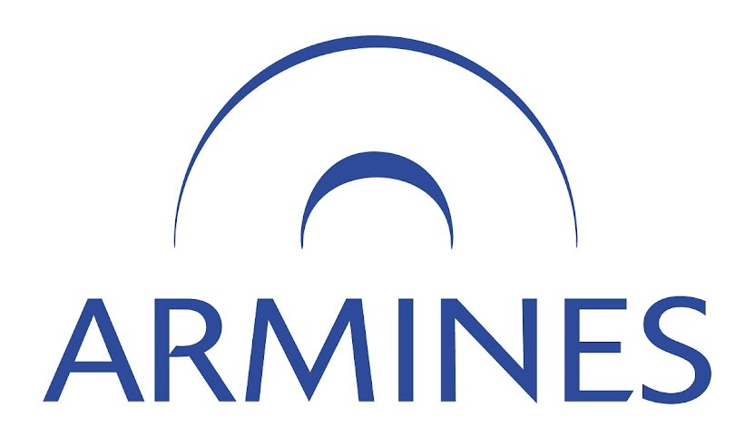
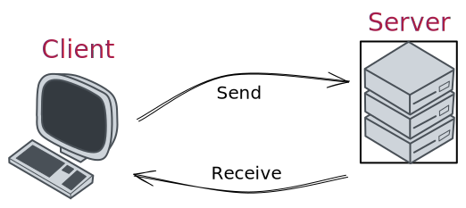
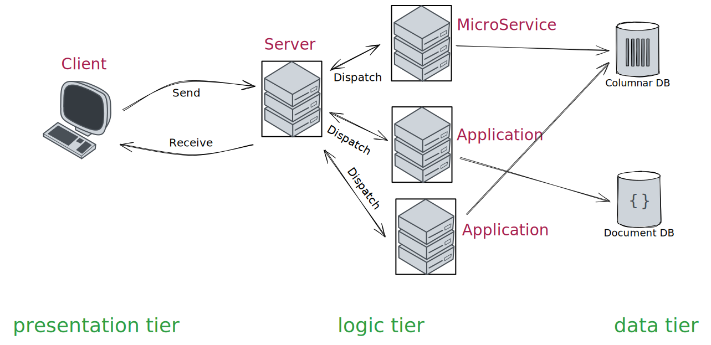
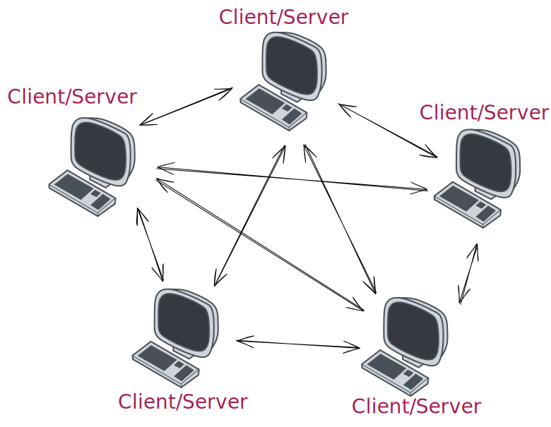
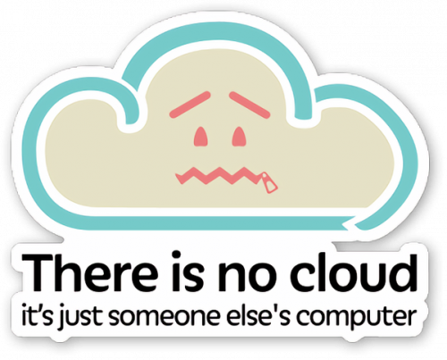
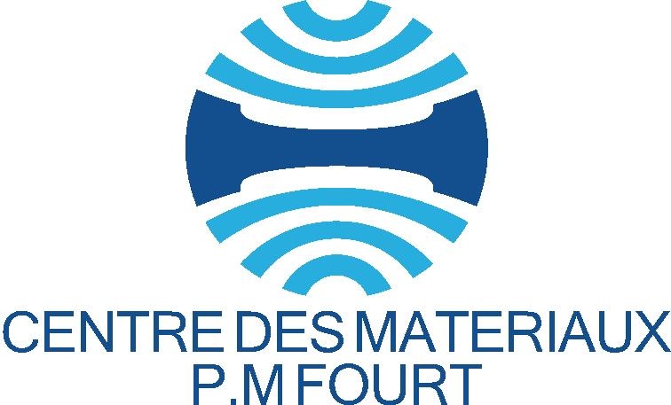
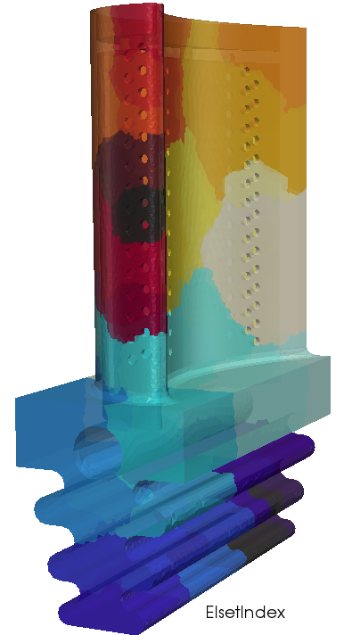

class: middle, slide_title

<!--  -->

# Programmes coopérents 🚀

## Introduction réseaux 🕸️

 <strong><i>Basile Marchand</i></strong> 1

.footnote[1 - Plateforme SISDev, Centre des Matériaux, MINES Paris - CNRS - Université PSL]

---

layout: true

<!--  -->

    

        2025 - <i> Réseaux & Backend</i>  
    

---

# La coopération - mythe ou réalité

.center[

]

La plupart des systèmes informatiques/services web que vous pouvez utiliser quotidiennement ne sont pas **une** application mais un **ensemble** d'application qui intéragissent entre elles.

---

# A l'issue de ce cours

Le modèle coopérant le plus courant dans le monde de l'informatique met en jeu le concept de **réseau**. En effet dans le monde actuel tout est interconnecté via des réseaux. Et grâce à ce réseau il est possible de connecter tout un tas d'applications entre elles.

Cela introduit alors tout un tas de questions :

- comment communiquer entre deux applications sur un réseau ?
- Comment envoyer un message d'une application vers une autre via le réseau ?
- Sous quel format envoyer ce message ?
- Comment fait-on une application Python capable d'écouter sur le réseau ?

---

# Quel modèle de coopération ?

---

## Client-serveur

.center[]

---

## Architecture trois-tiers

.center[]

---

## Architecture pair à pair

.center[]

---

# Le Web

.center[]

---

# Le cloud

.center[
  
]

<!--

 
Centre de recherche commun MINES Paris - ARMINES et Unité Mixte de Recherche CNRS (7633).
 
 
Thématiques :
.center[Matériaux, Énergie, Durabilité, Sûreté]
  
Quelques chiffres:
- Création du centre en 1967 (initiative MINES Paris / SNECMA)
- Effectifs : ~ 200 personnes
  - 45 EC ; 35 ITA ; 80 Doctorants
- ~50 partenaires industriels
- ~60% de l'activité sur contrats directs avec les industriels
- ~100 publications dans revues internationales par an
- 20~25 thèses soutenues par an
- ~ 4 brevets déposés par an
- 2 Chaires en cours

  <i class="fa-solid fa-location-dot"></i> Actuellement à Evry mais déménagement sur le campus de Versaille Satory prévu pour été 2024.

-->

---

#

.center[

]

---

# CMAT et enseignement

- Programme Gradué PSL : Ingénierie, Sciences appliquées, Innovation
  - Master PSL : 2 mentions
    - Science et Génie des Matériaux (porté par le CMAT)
    - Énergie
  - Cycle Ingénieur Civil MINES Paris
    - Mécanique des Milieux Continus
    - Mécanique des Matériaux solides
    - Matériaux pour l'ingénieur
    - Informatique
    - ~ 10 enseignements spécialisé
    - Métier de l'Ingénieur Généraliste
    - 2 Options (Matériaux ; Ingénierie Digitale des Systèmes complexes)
    - 3 trimestres recherches
- Mastère spécialisé : Design des Matériaux et des Structures
- Formations doctorales :
  - Microscopie / caractérisation
  - Informatique scientifique
  - Simulation numérique

---

# CMAT et recherche

Assurer l'intégrité des matériaux et des structures par la prédiction et l'augmentation de la durée de vie
.center[<i>Vieillissement, Endommagement, Mécanique de la rupture</i>]

Améliorer les propriétés matériaux pour élargir leurs champs d'application
.center[<i>Allègement des structures, optimisation de microstructure, contrôle des procédés,  évolutions microstructurales au cours du viellissement en service</i>]

Développement de nouveaux matériaux
.center[<i>Matériaux biocompatibles, nouveaux alliages</i>]

Développement de nouveaux procédés
.center[<i>Selective Laser Melting, Cold Spray, Metal Binder Jeting</i>]

Développement de nouvelles approches de modélisation
.center[<i>Formulations EF, Réduction de modèle, Science des données, outils numériques</i>]

Quelques distinctions :  
2021 médaille d'argent CNRS S. Forest ; 2017 Prix Jean-Mandel T. Morgeneyer ; 2018 médaille de bronze CNRS V. Yastrebov ; 2018 Médaille Bastien et Guillet A.F Gourgues ; 2020 Médaille de l'académie de l'air et de l'espace G. Cailletaud.

---

# Moyens de calcul

.cols[
.fifty[
Un cluster de calcul auto-hébergé

- 43 noeuds de calcul Intel
  - (2x) Processeur Intel Xeon (12 coeurs)
  - 256 Go de RAM
- 4 noeuds de calcul AMD
  - (1x) Processeur AMD Epyc (48 coeurs)
  - 256 Go de RAM
- Réseau mellanox 25 Gb ethernet
- Stockage distribué Panasas 160 To utiles

  

~30 utilisateurs
 
 
Taux d'occupation moyen sur 2021 ~75%
]
.fifty[
Types de calculs :

- Simulations éléments finis :
  - Z-set
  - Abaqus explicit
  - Castem
- Analyse d'image
  - Matlab (génération de maillage)
  - Python
- Autres :
  - Optimisation : identification de paramètres
  - Analyse de sensibilité
  - Contruction de méta-modèles (krigeage, TT, ... )
    ]
    ]

---

# Outils de calculs

Le principal outil la suite logicielle Z-set, co-développement Centre des Matériaux et ONERA.
 
 
.center[Code de calcul éléments finis, dévéloppé depuis début 90 en C++ et constitué de plusieurs modules]
 
 

.center[

]

.footnote[Projet en cours : depuis un an développement d'un nouveau code de calcul pour remplacer Z-set.]

---

# Calcul parallèle distribué

  

  Comportement type AM1  
  Discrétisation spatiale : 7 Mdofs  
  Discrétisation temporelle : 28 incréments

  

    Résolution solveur MUMPS distribué  
    32 sous-domaines  
    4 coeurs/sous-domaine
  

  

  

--

  

    5 heures de calcul
  

--

<iframe width="420px" height="315" src="https://www.youtube.com/embed/90-kA3wYuoM?autoplay=1&mute=1&loop=1&controls=0&playlist=90-kA3wYuoM">
</iframe>

Comportement élasto-plastique  
Grandes déformations 
Discrétisation spatiale : 10 Mdofs 
Discrétisation temporelle : 222 incréments 

  

    Résolution solveur MUMPS distribué  
    48 sous-domaines  
    4 coeurs/sous-domaine
  

--

  

    90 heures de calcul
  

---

# Mécanique du contact

Prise en compte à différentes échelles des phénomènes de contact

.cols[
.fifty[

.center[]

Thèse B. Akula 2019
]
.fifty[
.center[]
.center[]

Thèse A. Shvarts 2019
]
]

.footnote[Thématique portée par Vladislav Yastrebov.]

# Mécanique de la rupture

Z-cracks: propagation de fissures de fatigues

  <iframe width="420px" height="315" src="https://www.youtube.com/embed/jFLLajbg38E?autoplay=0&mute=1&loop=1&controls=0&playlist=jFLLajbg38E">
  </iframe>

  <iframe width="420px" height="315" src="https://www.youtube.com/embed/vy2VRuaQL7A?autoplay=0&mute=1&loop=1&controls=0&playlist=vy2VRuaQL7A">
  </iframe>

.footnote[Développement V. Chiarrutini (ONERA)]

---

# Rupture ductile

Modèles d'endommagement, milieux poreux (modèles Gurson)

Par exemple calcul plastique poreux (Gurson)  
Éléments finis mixtes U-p  
3 Millions de dofs

<!-- 

<video controls autoplay loop src="static/media/output.ogg" width="500px">

 -->

<iframe width="500px" height="380" src="https://www.youtube.com/embed/4r6frld1UNE?autoplay=1&mute=1&loop=1&controls=0&playlist=4r6frld1UNE">
</iframe>

 <!-- plotly -->

Des travaux récents (Thèse A. El Ouazani) sur la transition endommagement rupture et l'insertion/propagation de fissure

---

# Homogénéisation Asymptotique

Homonégénisation et relocalisation des champs jusq'au 3ème ordre

  
  
Champs relocalisés vs solution exacte

  
  
Champs relocalisés et corrigés aux bords et carte d'erreur

.footnote[Thèse de Mouad Fergoug, thèse CIFRE Safran Tech, encadrement S. Forest, B. Marchand]

---

# Méthodes de réduction de modèle

.center[

]

.footnote[Thématique portée par D. Ryckelynck, P. Kerfriden, L. Lacourt]

---

class: middle, center

## Merci pour votre attention 

