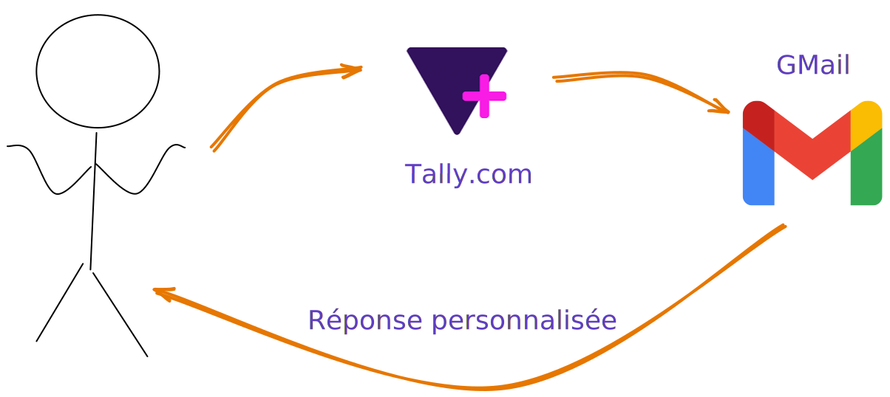
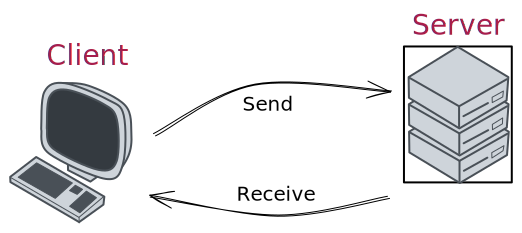
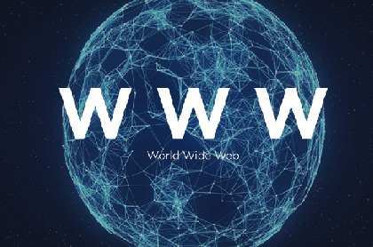

# Le monde connecté 🕸️

```{div}
:class: center
Le monde d'aujourd'hui est ultra connecté 🕸️
```

---


La plupart des systèmes informatiques/services web que vous pouvez utiliser quotidiennement ne sont pas **une** application mais un **ensemble** d'applications qui intéragissent entre elles.

---

## Premier use-case

Un élève répond à un questionnaire de satisfaction en ligne et après la soumission de son questionnaire reçoit automatiquement une réponse personnalisée et spécifique selon ses réponses.



[https://tally.so/r/w8N0jA](https://tally.so/r/w8N0jA)

<br><br>

---

## Un second use-case

<!-- <button onclick="copyFunction()">Email du support</button> -->


```{div}
:class: center
❓ Quels ingrédients, outils 🛠️ doivent être mis en oeuvre❓
```

---

# 👩‍🍳 Les ingrédients nécessaires 👨‍🍳

Des **applications** qui peuvent se **contacter**,
<br><br> **échanger** des **données**
<br><br> avec des règles clairement établies permettant de **déclencher des actions**

---

# Dans ce cours

On va essayer de répondre aux questions suivantes

- Comment communiquer entre deux applications sur un réseau ?
- Comment envoyer un message d'une application vers une autre via le réseau ?
- Sous quel format envoyer ce message ?
- Comment fait-on une application Python capable d'écouter sur le réseau ?

<iframe src="https://giphy.com/embed/l0HlRnAWXxn0MhKLK" width="480" height="348" frameBorder="0" class="giphy-embed" allowFullScreen></iframe>

---

# Architecture

Pour faire collaborer des applications ensemble il existe plein de modèles, d'architectures différentes

<iframe src="https://giphy.com/embed/JrSwnF7PLhgvmNfM8C" width="700p" height="348" frameBorder="0" class="giphy-embed" allowFullScreen></iframe>

On va regarder les plus classiques

---

## Client-serveur



---

## Architecture trois-tiers


---

## Architecture pair à pair


Très à la mode à une époque où Netflix/Amazon Prime/... n'existaient pas (oui oui cette période est réelle 🤯)

```{div}
:class: center
ℹ️ Projet [folding@home](https://apps.foldingathome.org/serverstats)
```

---

# Le Web

```{div}
:class: center



<br>
Juste un gros réseau
```

---

# Le cloud

```{div}
:class: center

Le cloud c'est quoi ?
<br>

```
