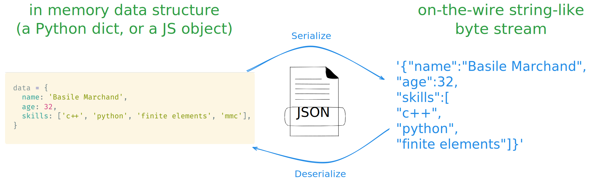

# Encodage de données

La couche 4 est-elle suffisante, ou avons-nous besoin d'un truc en plus ?

<br><br>
````{div}
:class: center
Avec tcp ou udp on peut faire nos transfert de données entre application
````
<br>
````{div}
:class: center
A votre avis c'est tout bon du coup ou on a besoin d'un truc en plus ?
````
<br><br>

--

````{div}
:class: center
🔎 Regardons sur un exemple concret 🔎
````

.columns[
.seventy[
```{div}
:class: center
le dossier `python/tcp-awkward-api`
<br>ou<br>
[https://replit.com/@BasileMarchand/tcpexample?v=1](https://replit.com/@BasileMarchand/tcpexample?v=1)
<br>ou<br>
[http://bit.ly/3YpoKDR](http://bit.ly/3YpoKDR)
<br>ou<br>
```
]
.thirty[

]
]

---

## Un verrou 🔒

````{div}
:class: center
Rien de standard dans mes échanges de données 😵‍💫
````
<br><br><br>
````{div}
:class: center
J'ai créé ma propre logique <br><br><br> mais elle ne l'est <strike>peut-être</strike> certainement pas aux yeux des autres.
````

--

<br><br><br>
````{div}
:class: center
Un peu de standardisation ne ferait pas de mal ...
````

---

## Au passage : tranfert de données ...

````{div}
:class: center
La grande question qui peut se poser est <br><br><br>sous quel format est-il pertinent d'échanger des données ❓
````

<br>
Le modèle OSI ne spécifie pas vraiment de format de données autre que dire c'est du binaire 🤨
<br><br>
La couche 6 spécifie un peu les choses en réalité mais ca donne un spectre assez large en fait
<br>

````{div}
:class: center
😩 Comment on fait si on veut faire transiter <br><br> un paquet de donnée structurée mais hétérogène ?
````

Par exemple les informations d'une personne :

````{div}
:class: center
Nom, Prénom, Date de naissance, nombre d'enfants, ...
````

---

## Sérialisation JSON

````{div}
:class: center

````

--

Via Python 🐍 c'est facile !

.columns[
.fifty[

```python
import json
data = dict(name="jean", age=1)
serialized = json.dumps(data)
# serialized is now a string
```

]
.fifty[

```python
import json
serialized = '{"name": "jean", "age": 1}'
data = json.loads(serialized)
# data is now a dictionary
```
]
]

---

## Haut niveau : la couche 7 du modèle OSI

C'est là que les choses concrètes commencent 🥳
<br><br><br>
````{div}
:class: center
***Couche 7 = couche Application***
````
<br><br><br>
Chaque "catégorie" d'application spécifie alors :

````{div}
:class: center
Comment se font les communications entre le client et l'application
<br><br>
format des message, contenu attendu, ...
````

.columns[
.fifty[
On parle de protocole, comme par exemple:

- Transfert de fichiers 📂 : (S)FTP, rsync
- Messagerie ✉️ : SMTP, POP, IMAP
- Sessions distantes : telnet, SSH
- et
]
.fifty[

  
]
]

