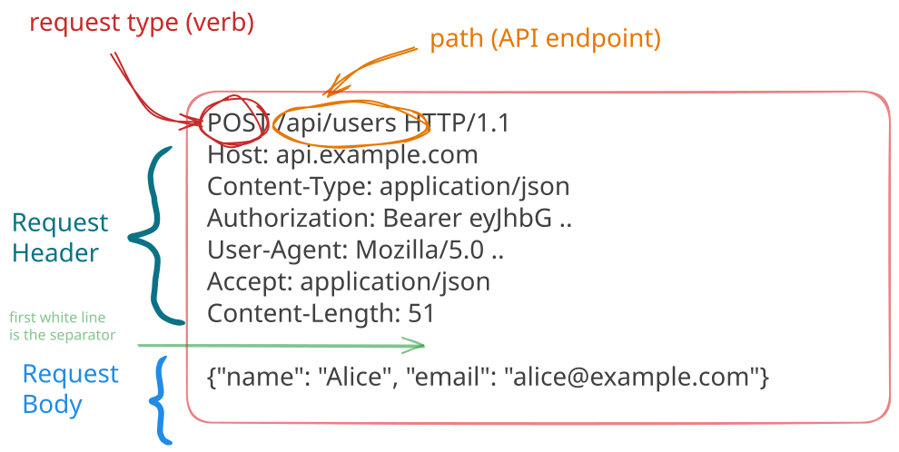
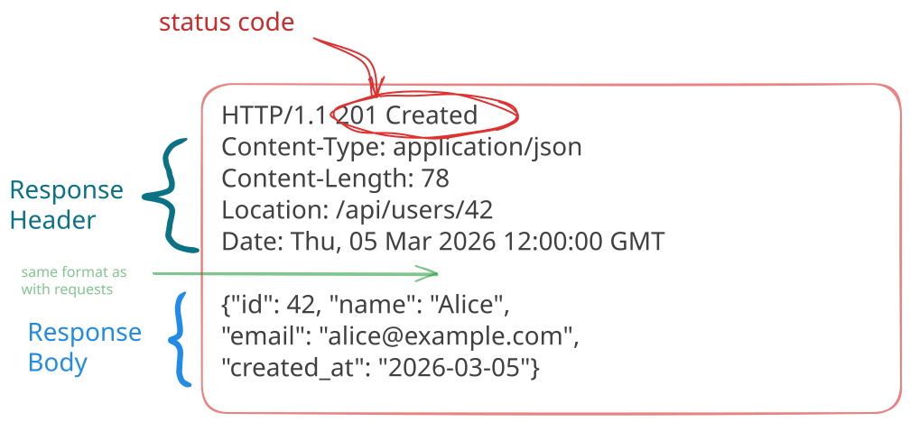

# The HTTP Protocol

## Request format

````{div}
:class: center

````

---

### HTTP 2.0 and beyond

We will use HTTP1.1 in this course but know that there are versions
more recent like HTTP2 and HTTP3 that bring improvements in
performance and security.

Notably HTTP2 introduces

- request multiplexing, allowing multiple requests to be sent in parallel on a single TCP connection.
- header compression, reducing the size of exchanged data.
- server push, allowing the server to send resources to the client
- a binary format for requests and responses, improving transmission efficiency.

```{div}
:class: smaller
And there is also HTTP/3 which uses QUIC (above UDP and no longer TCP)
as a transport protocol, offering additional improvements in
terms of latency and security.
```

```{admonition} so why use 1.1 then ?
:class: dropdown admonition-small
Versions 2.0 and 3.0 of HTTP use binary formats for requests and responses  
which makes them unlegible to the human eye !  
This makes them less practical for learning and debugging, which is why we will use HTTP 1.1 in this course,
which aims at introducing the basics of backend development.
```

---

## Request types

You may have noticed the `GET` in the previous request.

Basically it's to say that we want to make a `GET` type request.  
Implied there are other types of requests&nbsp;:

- `GET`: requests to **_obtain_** a resource from the server (html/css/js file, image, video, data, ...)
- `POST`: requests to **_send_** data to the server for processing (adding a user to a database, ...)
- `PATCH`: requests to **_partially modify_** a server resource (updating a user's email address in the database)
- `DELETE`: requests to **_delete_** a server resource (delete a comment on an article, ... )

These are the main types of requests but there are others, for the complete list you can take a tour here
<https://fr.wikipedia.org/wiki/Hypertext_Transfer_Protocol>

````{div}
:class: center
⚠️ In practice it often happens that `POST` is used, instead of `PATCH`, <br> to update data already present on the server side ... 🤢
````

---

## → Let's experiment

In Python 🐍 you suspect there is everything you need!!

```python
import requests
```

We will use

```{div}
:class: center
the site <http://httpbin.org> which provides a relatively useful test server.
```

```{admonition} see complete code example in
:class: seealso external-code
`python/httpbin-client/`
```

---

## Response format

````{div}
:class: center

````

---

## Return codes

When we make a request to a server via http/https, the latter returns us first a return code.
These codes are standardized (non-exhaustive list)&nbsp;:

- 2xx: ok everything went well ✅
  - normally 200
- 3xx: redirect
  - 301/302: page redirection, temporary or not ⤴️
- 4xx: error
  - 401: you need to authenticate 🔐
  - 403: wait a minute you don't have the right to access this! ⛔
  - 404: what you're asking me doesn't exist ⁉️
- 5xx: that's a server problem 💣

And so the first thing to do when you make a request to a server is to check that the return code is 2xx because otherwise there's no point in continuing!

---

## The notion of API

````{div}
:class: center
Application Programming Interface
````

Allows to define how a **consumer** program will be able to exploit the **functionalities** given by a **provider** program

In the particular domain of the Web, the API is actually defined from a URL. Indeed, access to the resource is done by making a GET request (or POST, depending on the case) on a particular URL.

````{div}
:class: center
```{figure} media/api_img.jpg
:width: 60%
Image from Jérémy Mésière, Architecte Middleware chez Manutan
```
````

---

## REST API

````{div}
:class: center
**Representational State Transfer**
````

Set of principles governing Web application architecture.

`````{div}
:class: columns smaller
````{div}
:class: fifty

- **HTTP Methods**:

  Operations are performed using HTTP methods: GET (read), POST (create), PUT/PATCH (update), DELETE (delete).
  Example: A GET request to a blog API to retrieve a specific article.

- **Resources**:

  In REST, all data or states are considered as "resources".
  Each resource is **uniquely identified** by a URI (Uniform Resource Identifier).
  Example: /articles/123 can represent the resource for the article with ID 123.

````

````{div}
:class: fifty

- Stateless:

  Each REST API request must **contain all the necessary information** to be understood by the server. **No session state** is maintained on the server.
  Advantages: Simplifies server design and improves scalability.

- **Resource representation**:

  Resources can be represented in different formats, JSON and XML being the most common.
  The choice of format is often indicated in the HTTP Content-Type header of the request.

````
`````

---

## The importance of HTTP headers

````{div}
:class: center
HTTP headers are parameters sent in HTTP requests and responses that provide essential information about the HTTP transaction.
````

Notably this will allow us to manage authentication 🔐 when we want to access protected APIs, the data format, the API version

Some **_classic_** headers:

- `Content-Type`: indicates the media type of the request or response body. In the context of REST APIs, `application/json` is commonly used, indicating that we only work with JSON.
- `Accept`: the type of content we accept in response, generally `application/json` as well
- `Authorization`: we will see in the next slide that it allows to manage authentication when we want to access a protected resource
 