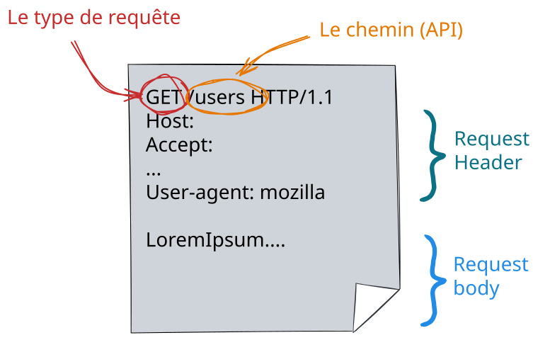

# Le protocole HTTP

## Format d'une requête

````{div}
:class: center

````

---

### HTTP 2.0 et au delà

Nous utiliserons HTTP1.1 dans ce cours mais sachez qu'il existe des versions
plus récentes comme HTTP2 et HTTP3 qui apportent des améliorations de
performance et de sécurité.

Notamment HTTP2 introduit

- la multiplexion des requêtes, permettant d'envoyer plusieurs requêtes en parallèle sur une seule connexion TCP.
- la compression des en-têtes, réduisant la taille des données échangées.
- le push de serveur, permettant au serveur d'envoyer des ressources au client
- un format binaire pour les requêtes et réponses, améliorant l'efficacité de la transmission.

```{div}
:class: smaller
Et il existe aussi HTTP/3 qui utilise QUIC (au dessus de UDP et non plus TCP)
comme protocole de transport, offrant des améliorations supplémentaires en
termes de latence et de sécurité.
```

---

## Types de requêtes

Vous avez peut être remarqué le `GET` dans la requête précédente.

En gros c'est pour dire que l'on veut faire un requête de type `GET`.  
Sous-entendu il existe d'autres types de requête&nbsp;:

- `GET` : requêtes pour **_obtenir_** du serveur une ressource (fichier html/css/js, image, video, données, ...)
- `POST` : requêtes pour **_envoyer_** des données au serveur en vu d'un traitement (ajout d'un utilisateur dans une base de données, ...)
- `PATCH` : requêtes pour **_modifier partiellement_** une ressource du serveur (mettre à jour l'addresse mail d'un utilisateur dans la base de données)
- `DELETE` : requêtes pour **_supprimer_** une ressource du serveur (supprimer un commentaire sur un article, ... )

Il s'agit là des principaux types de requêtes mais il en existe d'autres, pour la liste complète vous pouvez faire un tour ici
<https://fr.wikipedia.org/wiki/Hypertext_Transfer_Protocol>

````{div}
:class: center
⚠️ En pratique il arrive souvent que `POST` soit utilisée, à la place de `PATCH`, <br> pour mettre à jour une donnée déjà présente côté serveur ... 🤢
````

---

## Expérimentons

Dans Python 🐍 vous vous en doutez il existe tout ce qu'il faut !!

```python
import requests
```

Nous allons utiliser

```{div}
:class: center
le site <http://httpbin.org> qui met à disposition un serveur de test relativement utile.  
et le dossier `python/httpbin-client` du cours
```

---

## Les codes de retour

Lorsque l'on fait une requête à un serveur via http/https, ce dernier nous renvoie en premier lieu un code de retour.
Ces codes sont normalisés (liste non exhaustive)&nbsp;:

- 2xx : ok tout s'est bien passé ✅
  - normalement 200
- 3xx : redirect
  - 301/302 : redirection de la page, temporaire ou pas ⤴️
- 4xx: erreur
  - 401 : il faut s'authentifier 🔐
  - 403 : minute papillon tu n'as pas le droit d'accéder à ça ! ⛔
  - 404 : ce que tu me demandes n'existe pas ⁉️
- 5xx : la c'est un problème de serveur 💣

Et donc la première chose à faire lorsque vous faites une requête à un serveur c'est de vérifier que le code de retour est bien 200 car sinon pas la peine de continuer !

---

## La notion d'API

````{div}
:class: center
Application Programming Interface
````

Permet de définir comment un programme **consommateur** va pouvoir exploiter les **fonctionnalités** données d'un programme **fournisseur**

Dans le domaine particulier du Web l'API, se définit en fait à partir d'une URL. En effet l'accès à la ressource se fait en effectuant une requête GET (ou POST, selon les cas) sur une URL particulière.

````{div}
:class: center
```{figure} media/api_img.jpg
:width: 60%
Image from Jérémy Mésière, Architecte Middleware chez Manutan
```
````

---

## API REST

````{div}
:class: center
**Representational State Transfer**
````

Ensemble de principes gouvernant l'architecture d'application Web.

`````{div}
:class: columns smaller
````{div}
:class: fifty

- **Méthodes HTTP** :

  Les opérations sont réalisées à l'aide des méthodes HTTP : GET (lire), POST (créer), PUT/PATCH (mettre à jour), DELETE (supprimer).
  Exemple : Une requête GET à l'API d'un blog pour récupérer un article spécifique.

- **Ressources** :

  Dans REST, toutes les données ou états sont considérés comme des "ressources".
  Chaque ressource est **identifiée de manière unique** par une URI (Uniform Resource Identifier).
  Exemple : /articles/123 peut représenter la ressource pour l'article avec l'ID 123.

````

````{div}
:class: fifty

- Sans état (**Stateless**) :

  Chaque requête de l'API REST doit **contenir toutes les informations nécessaires** pour être comprise par le serveur. **Aucun état de session** n'est conservé sur le serveur.
  Avantages : Simplifie la conception du serveur et améliore la scalabilité.

- **Représentation des ressources** :

  Les ressources peuvent être représentées en différents formats, JSON et XML étant les plus courants.
  Le choix du format est souvent indiqué dans l'en-tête HTTP Content-Type de la requête.

````
`````

---

## L'importance des headers HTTP

````{div}
:class: center
Les headers HTTP sont des paramètres envoyés dans les requêtes et réponses HTTP qui fournissent des informations essentielles sur la transaction HTTP.
````

Notamment cela va nous permettre de gérer l'authentification 🔐 lorsqu'on veut accéder à des API protégées, le format des données, la version de l'API

Quelques headers **_classiques_** :

- `Content-Type` : indique le type de média du corps de la requête ou de la réponse. Dans le cadre des API REST, `application/json` est couramment utilisé, indiquant que l'on ne travaille qu'avec du JSON.
- `Accept` : le type de contenu que l'on accepte en réponse, généralement ̀`application/json` également
- `Authorization` : on va voir dans la prochaine slide qu'il permet de gérer l'authentification lorsqu'on veut accéder à une ressource protégée
 