<!--  -->


# coté réseaux 🚀

## Introduction réseaux 🕸️

<p> <strong><i>Basile Marchand</i></strong><sup> 1</sup></p>

.footnote[1 - Plateforme SISDev, Centre des Matériaux, MINES Paris - CNRS - Université PSL]

---

layout: true


<!--  -->

<div class="slide_footer">
    <div class="wrap">
        <span>2025 - <i> Réseaux & Backend</i>
        - <a class="current-slides" href="slides1.html">1/3: Réseaux</a>
        - <a href="slides2.html">2/3: Coté Serveur!</a>
        - <a href="slides3.html">3/3: Flask</a>
        - <a href="slides4.html">4: Addendum</a>
        </span>
    </div>
</div>

---

# Le monde d'aujourd'hui - ultra connecté 🕸️

.center[
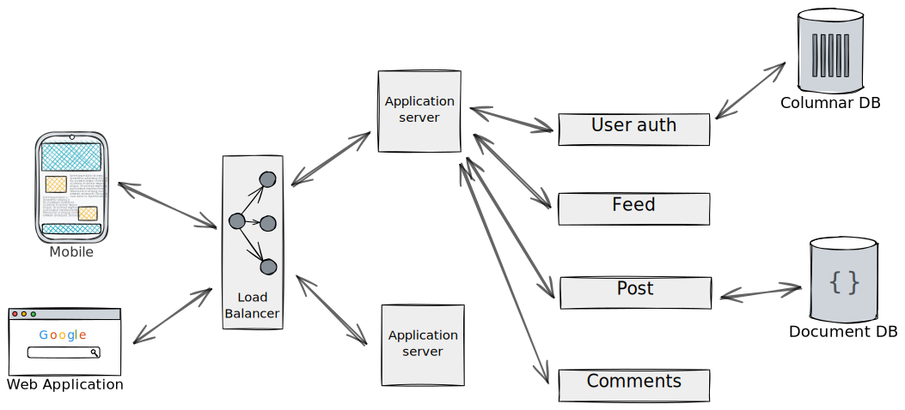
]

La plupart des systèmes informatiques/services web que vous pouvez utiliser quotidiennement ne sont pas **une** application mais un **ensemble** d'applications qui intéragissent entre elles.

---

# Premier use-case

Un élève répond à un questionnaire de satisfaction en ligne et après la soumission de son questionnaire reçoit automatiquement une réponse personnalisée et spécifique selon ses réponses.

.center[
  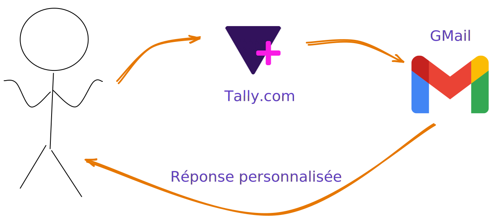
]

.center[
[https://tally.so/r/w8N0jA](https://tally.so/r/w8N0jA)
]

<br><br>
.center[
❓ Quels ingrédients, outils 🛠️ doivent être mis en oeuvre❓
]

---

# Un second use-case

.center[
<button onclick="copyFunction()">Email du support</button>
]

.center[
    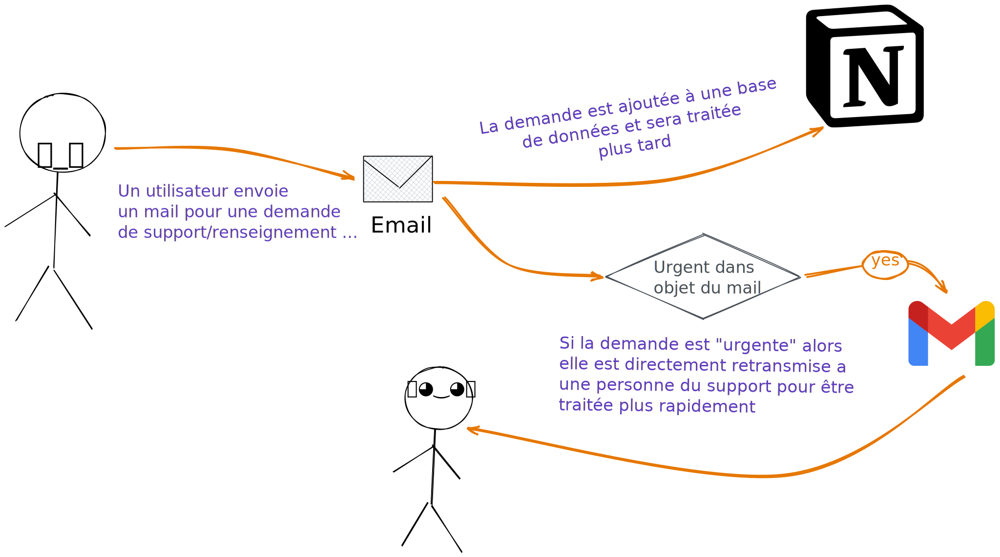
]

.center[
❓ Quels ingrédients, outils 🛠️ doivent être mis en oeuvre❓
]

---

class: center, middle

# 👩‍🍳 Les ingrédients nécessaires 👨‍🍳

<br><br><br>
Des **applications** qui peuvent se **contacter**, <br><br> **échanger** des **données**
<br><br> avec des règles clairement établies permettant de **déclencher des actions**

---

# Dans ce cours

On va essayer de répondre aux questions suivantes

- Comment communiquer entre deux applications sur un réseau ?
- Comment envoyer un message d'une application vers une autre via le réseau ?
- Sous quel format envoyer ce message ?
- Comment fait-on une application Python capable d'écouter sur le réseau ?

.center[

<iframe src="https://giphy.com/embed/l0HlRnAWXxn0MhKLK" width="480" height="348" frameBorder="0" class="giphy-embed" allowFullScreen></iframe>
]

---

# Architecture

Pour faire collaborer des applications ensemble il existe plein de modèles, d'architectures différentes

<div class="center">
  <iframe src="https://giphy.com/embed/JrSwnF7PLhgvmNfM8C" width="700p" height="348" frameBorder="0" class="giphy-embed" allowFullScreen></iframe>
</div>

On va regarder les plus classiques

---

## Client-serveur

.center[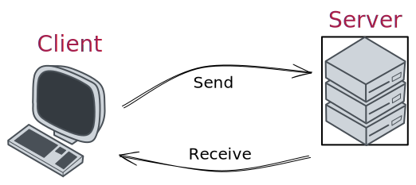]

---

## Architecture trois-tiers

.center[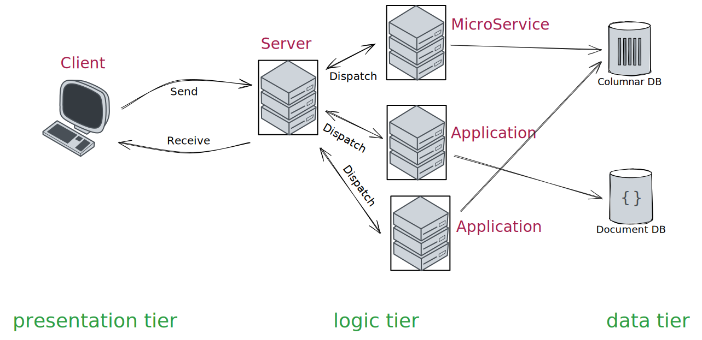]

---

## Architecture pair à pair

.center[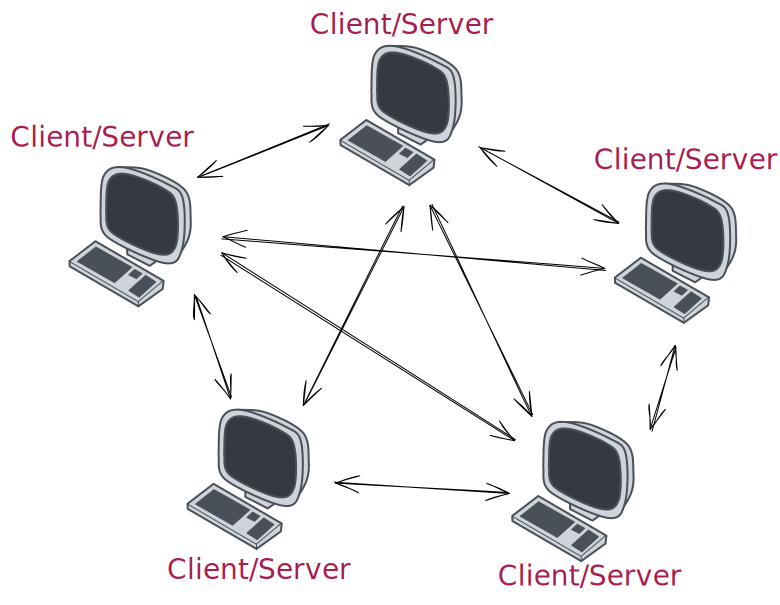]

Très à la mode à une époque où Netflix/Amazon Prime/... n'existaient pas (oui oui cette période est réelle 🤯)

ℹ️ Projet [folding@home](https://apps.foldingathome.org/serverstats)

---

# Le Web

.center[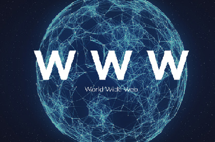]

.center[Juste un gros réseau]

---

# Le cloud

.center[
]

---

class: middle, center

# Le réseau : principe

---

# Réseau

## Infrastructure

Tout d'abord un réseau c'est quoi ?

.center[Et bien c'est une **infrastructure** que l'on utilise pour faire transiter des données. ]

Dans sa version la plus élémentaire qui soit un réseau est composé de deux appareils reliés entre eux, par un câble réseau par exemple.

Le point important là-dedans c'est qu’un appareil connecté au réseau doit posséder une **interface réseau**, un composant capable de communiquer c'est-à-dire d'envoyer et recevoir un signal.

Par exemple votre ordinateur portable possède deux interfaces réseau : la prise RJ45 et la carte wifi. Le signal qui transite par l'interface réseau est un signal binaire.

.center[
**⚠️ L'appareil en lui-même n'a pas besoin de connaître la signification de ce signal, <br> car c'est un programme tournant derrière l'interface réseau qui se chargera de traiter le signal en question ⚠️**
]

---

# Petite parenthèse

## Supercalculateur : un modèle peer-to-peer

<!-- <div style="position: absolute; left: 10%; top: 25%;"> -->

<!-- </div> -->

<!-- <div style="position: absolute; left: 35%; top: 35%;"> -->

<!-- </div> -->

<!-- <div style="position: absolute; left: 55%; top: 55%;"> -->
<iframe width="400px" height="280" src="https://www.youtube.com/embed/4r6frld1UNE?autoplay=1&mute=1&loop=1&controls=0&playlist=4r6frld1UNE">
</iframe>
<!-- </div> -->

<!-- <div style="position: absolute; left: 65%; top: 25%;"> -->
<iframe width="320px" height="215" src="https://www.youtube.com/embed/90-kA3wYuoM?autoplay=1&mute=1&loop=1&controls=0&playlist=90-kA3wYuoM">
</iframe>
<!-- </div> -->

---

# High Performance Computing

.center[Diviser pour mieux régner]

<div>
<p style="font-size: small;"> Décomposition en sous-domaines </p>
  
</div>

--

<!-- <div style="position: absolute; left: 40%; top: 25%"> -->
  <p style="font-size: small;"> Chaque sous-domaine "envoyé" <br> sur une machine de calcul </p>
     
<!-- </div> -->

--

<!-- <div style="position: absolute; left: 75%; top: 25%"> -->
  <p style="font-size: small;"> Chaque sous-domaine "éclaté" par paquet d'éléments <br>pour l'intégration de la loi de comportement
     
<!-- </div> -->

--

<!-- <div style="position: absolute; left: 30%; top: 65%"> -->
  <p> Au niveau de chaque sous-domaine : </p>
  <ul>
    <li>Opérations algébriques distribuées </li>
    <li>Résolution de problèmes locaux (solveurs DD)</li>
  </ul>
<!-- </div> -->

---

# Réseau

## Différentes qualités

La qualité du réseau, un petit truc qui a son importance suivant l'application 🚀 <button onclick="plot_network()"> click me 📈 </button>

.center[

<div id="plot_network"></div>
]

.center[
⏳️ Sur des grosses simulations le temps des échanges peut représenter 20% du temps de calcul 💣
]

---

class: middle, center

# Un réseau et c'est tout ?

---

# Modèle OSI

.cols[
.fifty[

.center[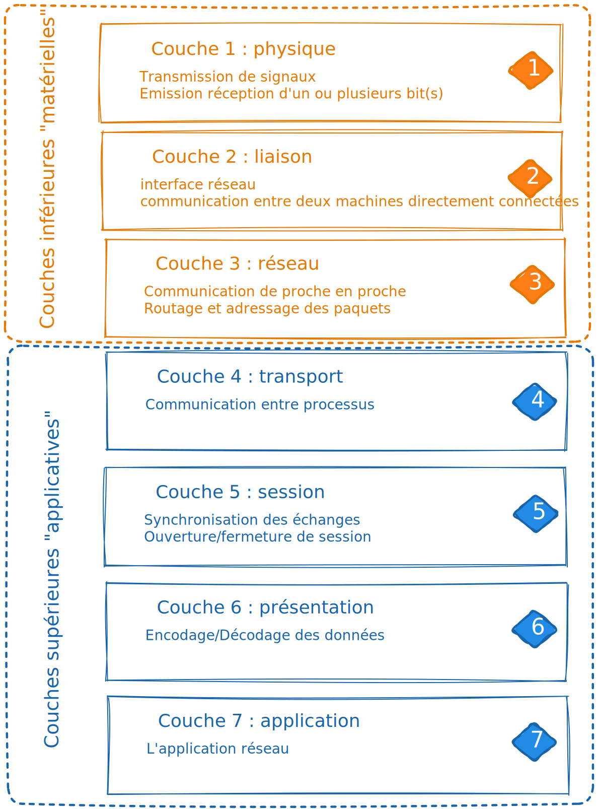]

]
.fifty[
<br><br><br>
**O**pen **S**ystem **I**nterconnexion
<br><br><br>

**norme** mise en place par le commité ISO en 1984
<br><br><br>

Objectifs :
<br><br><br>

.center[standardiser les communications<br> entre appareils sur un réseau]

]
]

---

# Adressage

.center[Associer à chaque interface de chaque machine sur un réseau une adresse unique]
<br><br>
Cette addresse peut être _temporaire_ ou bien _fixe_.
<br><br>
C'est ce qu'on appelle l'adresse IP, pour _Internet Protocol_. L'adresse IP d'une interface réseau s'écrit comme une combinaison de quatre nombres compris entre 0 et 255.
<br><br>
.center[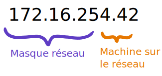]

.footnote.smaller[
il y a donc deux parties : l'adresse du réseau (souvent sur 24 bits) et l'adresse de l'hôte (souvent sur 8 bits)  
lorsqu'on a besoin d'écrire l'adresse d'un réseau on écrit alors comme ceci le nombre de bits de l'adresse réseau
.center[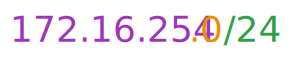]
]

---

## Adresses IPv6

**en 2011** on prévoit **l'épuisement 💣 des adresses IP** disponibles !...

2<sup>32</sup> = 4,294,967,296 c'est-à-dire environ 1/2 adresse par personne sur terre  
(bien sûr certaines personnes en ont plus que d'autres 😅)

Il a donc été mis en place le protocol **IP v6** (l'ancien protocole était le **v4**)

Le principe est simple: passer d'une adresse sur **32 bits** à une adresse sur **128 bits**  
par exemple (en hexa) `2001:0db8:0000:85a3:0000:0000:ac1f:8001`  
En fait on a tellement d'adresses que l'on peut donner une adresse IP à chaque grain de sable sur terre 🏖  ️

<br>
Actuellement déployé **mais en partie** - principalement, mais pas que, dans le coeur de réseau chez les opérateurs

Et pourquoi pas partout, me direz-vous ?  
eh bien notamment, le besoin de IPv6 est moins important que prévu grâce notamment au NAT  
on en reparlera...

---

# Interconnexion

## Réseau local

.center[
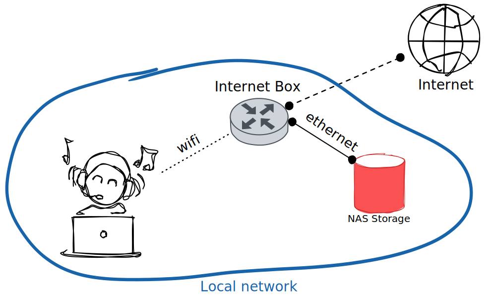

]

---

# Interconnexion

## Réseau distant

.center[
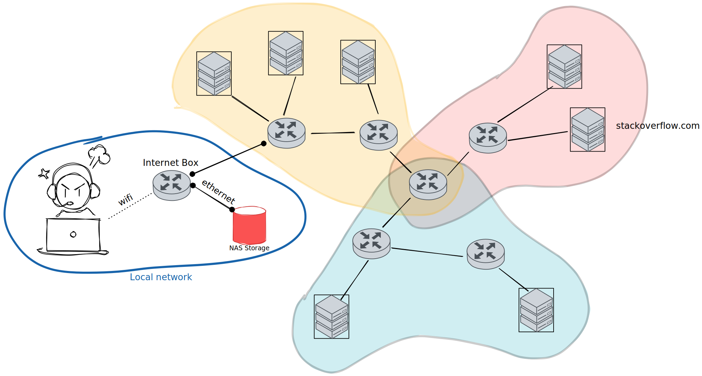
]

---

# Interconnexion

Pour résumer :
.center[interconnexion qui constitue en fait la troisième couche du modèle OSI ]

gère trois éléments :
<br>

- Routage
  .center[
  chemin entre deux machines dans des réseaux différents, <br>chemin passant par les passerelles (routeurs)<br>ces fameuses machines ayant des interfaces dans deux réseaux distincts.
  ]
- Relayage
  .center[s'occupe, une fois la route déterminée, <br>de faire transiter l'information de la machine A à la machine B]

- Contrôle de flux
  .center[une fonctionnalité optionnelle mais néanmoins essentielle <br> qui permet de décongestionner l'ensemble du réseau (au sens large). <br>Un peu le Waze du transit de données]

---
name: my-ip-address

## (Au passage c'est quoi mon IP ?)

.cols[

.fifty[
Comment je fais pour connaitre mon IP ?
]
.fifty[
pour commencer je clone le cours (si ce n'est déjà fait)  
sur github: `ue22-p24/web`  
et je me rends dans le dossier `python/ip-address`
]
]

.cols[
.fitfy[
je demande à un site extérieur

```sh
$ cat my-public-ip.py
import requests

response = requests.get("https://api64.ipify.org?format=json")
public_ip = response.json()["ip"]

print("Public IP:", public_ip)
```
]
.sixty[
je demande à mon OS (*)

```sh
$ cat my-local-ip.py
import socket

def get_outgoing_ip():
    with socket.create_connection(("8.8.8.8", 53)) as s:
        return s.getsockname()[0]

print("Outgoing IP:", get_outgoing_ip())
```
]
]

.cols[
  .fifty[
  et j'obtiens (essayez !)
```sh
$ python my-public-ip.py
*Public IP: 138.96.202.10
```

  ]
  .fifty[
  .. et ça peut être différent ! quel est ce mystère ?
```sh
$ python my-local-ip.py
*Outgoing IP: 10.1.1.15
```
  ]
]

.footnote.small[(*): depuis le terminal, utiliser: `ipconfig` sur Windows, `ifconfig` sur MacOS, `ip address show` sur Linux]

---

## le NAT (Network Address Translation)

.cols[

.sixty-five[
et mon petit doigt me dit que:

- vous allez tous avoir **la même adresse publique**
- mais pour la deuxième vous avez chacun une **adresse locale différente**

en fait il y a deux types d'adresses IP :

- publiques: celles qui sont visibles sur le réseau, et qui sont uniques
- privées: celles qui sont utilisées **uniquement** dans un réseau local

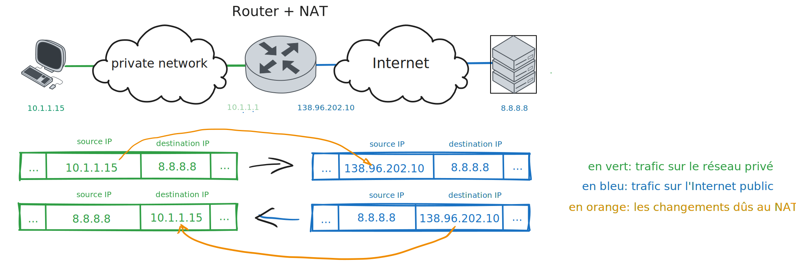
]

.thirty-five[
<br><br>
les adresses privées réservées:

- `192.168.0.0/16` <br> 2<sup>16</sup> = 65,536 adresses

- `172.16.0.0/12` <br> 2<sup>20</sup> = 1,048,576 adresses

- `10.0.0.0/8` <br> 2<sup>24</sup> = 16,777,216 adresses
]
]

---

# Les noms de domaines là-dedans !

Retenir les adresses IP c'est quand même pas super 🤯 !

.center[
Par exemple imaginez que vous deviez retenir `91.134.82.158` <br/>pour savoir les salles de cours .... <strike>on ne vous verrait pas souvent !</strike>
]

.footnote[`*` c'est l'adresse IP du serveur qui héberge OASIS]

--

Un truc magique le :

.center[ **DNS** = **D**omain **N**ame **S**ystem]

En gros c'est le service qui fait l'association entre un nom de domaine et un adresse IP.

--

.cols[

.fifty[
```bash
# plusieurs utilitaires pour faire des requêtes DNS

$ nslookup oasis.minesparis.psl.eu
Server:		192.168.0.1
Address:	192.168.0.1#53

Non-authoritative answer:
Name:	oasis.minesparis.psl.eu
*Address: 91.134.82.158
```
]

.fifty[

```bash
$ host oasis.minesparis.psl.eu
*oasis.minesparis.psl.eu has address 91.134.82.158
```

```bash
$ dig @8.8.8.8 oasis.minesparis.psl.eu A +noall +answer

; <<>> DiG 9.10.6 <<>> @8.8.8.8 oasis.minesparis.psl.eu A +noall +answer
; (1 server found)
;; global options: +cmd
*oasis.minesparis.psl.eu. 161	IN	A	91.134.82.158
```

]
]

---

class: center, middle

# On sait s'orienter, comment on cause maintenant

➡️ On a besoin de la 4ème couche du modèle OSI

---

# La couche transport 🚗

La quatrième couche du modèle

> spécification de comment on fait pour envoyer des données <br>
> d'un serveur A vers un client B et inversement.

Différents protocole établis :

- TCP
- UDP
- ...

<br><br>
**⚠️ Attention ⚠️**
<br><br>
.center[
La couche transport ne fait que définir la ***manière*** dont deux applications communiquent
<br><br>
mais ne spécifie en rien le ***contenu*** de ces communications
]

---

# Un serveur == une application ?

Connaitre l'IP du serveur ne vous permet pas encore de communiquer avec l'application qui se trouve sur ce serveur
<br>

.center[❓ D'ailleurs sur un serveur il ne peut y avoir qu'une application réseau ou peut-on en mettre plusieurs ❓]

--

.cols[

.seventy-five[
On peut avoir plusieurs applications sur un même serveur, et heureusement 🥳

Le choix de l'application avec laquelle on va discuter implique la notion de **_port_**

.center[ port = porte d'entrée du service 🚪]

.center[(mais on ne fait pas tourner autant d'applications sur un serveur)]
]
.twenty-five[
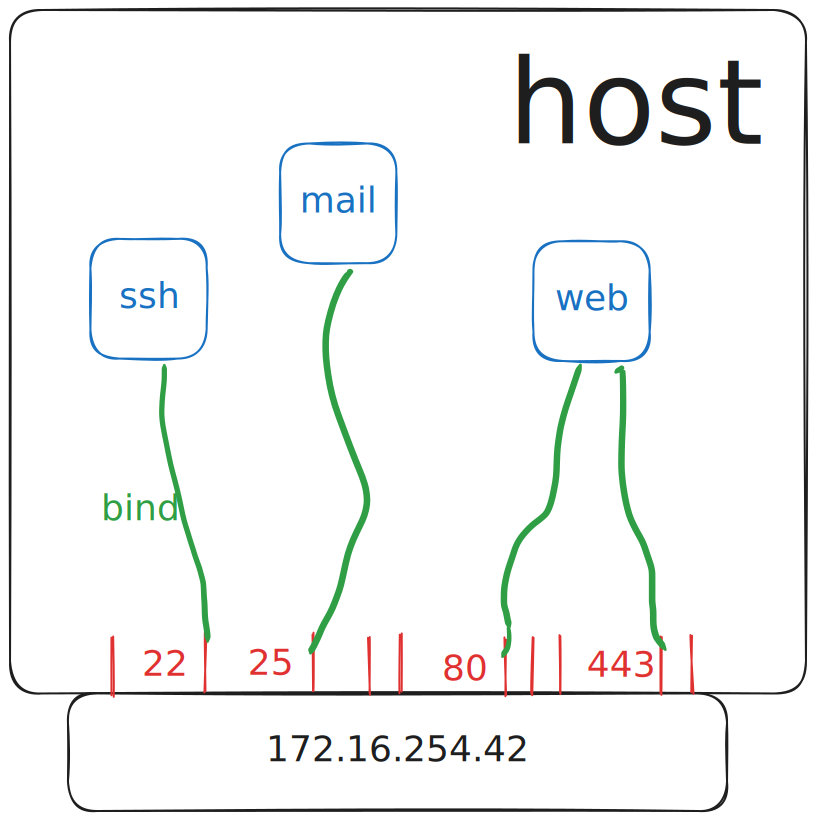
]
]

---

# Les ports standard

.cols[

.fifty[

Sur une machine on a 2<sup>16</sup> = 65,536 ports
]

.fifty[
Quelques port normalisés :

service | port
-|-
SSH | 22
SMTP | 25
DNS | 53
HTTP | 80
HTTPS | 443
... | ...
]
]

<br>

et voici à quoi ressemble un paquet:

<br>

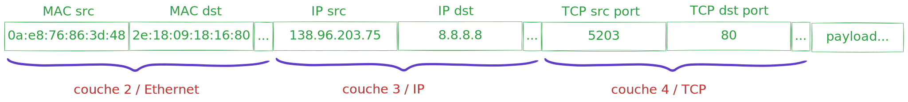

---

# Bas niveau

## TCP/IP

.center[Transmission Control Protocol]
<br><br>
est **le** protocole historique (Bob Kahn et Vinton Cerf, Septembre 1973), qui doit sa longévité par sa robustesse et sa fiabilité.
<br>

.center[Aujourd'hui lorsque vous naviguez sur le web<br>la plupart des échanges qui ont lieu entre votre navigateur et les sites web sont basés sur du TCP]

<br>
Le principe du TCP est très simple et se décompose en trois étapes:

- établissement de la connexion
- transfert de données
- fin de la connexion

---

# Bas niveau

## TCP/IP : open

.cols[
.fourty[
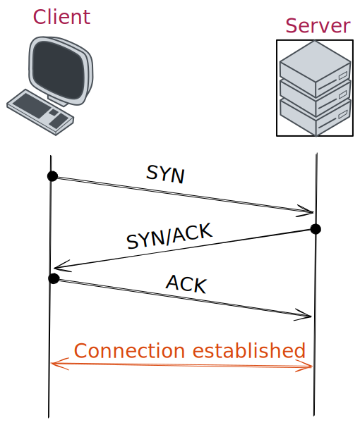
]
.fifty[
La connexion d'un client à un serveur TCP se décompose en trois étapes

.center[___three way handshake___]

de la manière suivante :

- 1️⃣ Client : Hello le serveur tu m'entends ?
  <br><br>
- 2️⃣ Serveur : Oui je t'entends et toi ?
  <br><br>
- 3️⃣ Client : Oui c'est bon je t'entends
  <br><br>

  ]
]

---

# Bas niveau

## TCP/IP : close

.cols[
.fourty[

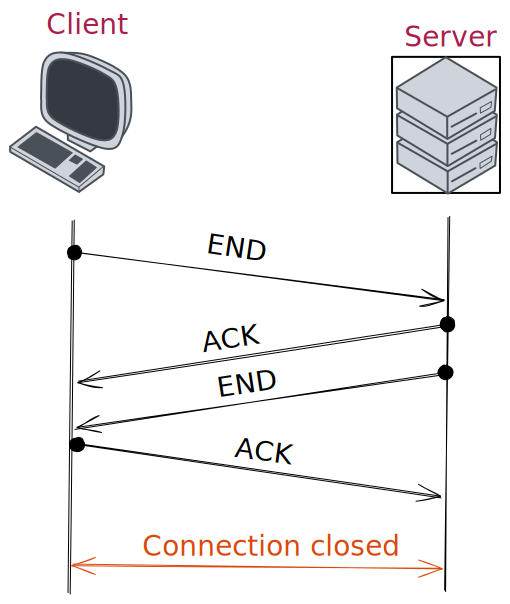

]
.fifty[
Clotûre en 4 étapes
<br><br>

- 1️⃣ Client : j'ai fini
  <br><br>
- 2️⃣ Serveur : Ok c'est noté
  <br><br>
- 3️⃣ Serveur : moi aussi je n'ai plus rien à te dire
  <br><br>
- 4️⃣ Client : Ok à la prochaine
  ]
  ]

---

# Regardons un peu en vrai comment ca marche

.center[
le dossier `python/tcp` du cours
<br>ou<br>
[https://replit.com/@BasileMarchand/TcpExample?v=1](https://replit.com/@BasileMarchand/TcpExample?v=1)
<br>ou<br>
[http://bit.ly/3HHQ49i](http://bit.ly/3HHQ49i)
<br>ou<br>

]

---

# Bas niveau

## TCP un truc de riche 🤑

Vous pouvez donc voir qu'avec cette approche
<br><br>
.center[
✅ la connexion est extrêmement fiable et il y a peu de chances d'avoir des loupés
]
<br><br>
En revanche cette fiabilité n'est pas gratuite 💰️
<br><br>
.center[
❌ elle s'accompagne d'un coût en terme d'échanges relativement élevé]
<br><br>
C'est pour cela qu'il existe une alternative au TCP 😯

---

# Bas niveau

## UDP

Le protocole UDP (User Datagram Protocol) est complémentaire au protocole TCP. Créé par David Reed en 1980.

Cas d'usage :

.center[Transmission rapide de données et réception de l'intégralité **pas impérative**]

.center[

TCP = très fiable mais lent

*vs*
<br>

UDP = rapide mais peu fiable
]

--

Les applications :

.center[

]

---

# La couche 4 suffisante ou besoin de plus ?

<br><br>
.center[Avec tcp ou udp on peut faire nos transfert de données entre application]
<br>
.center[A votre avis c'est tout bon du coup ou on a besoin d'un truc en plus ?]
<br><br>

--

.center[ 🔎 Regardons sur un exemple concret 🔎 ]

.cols[
.seventy[
.center[
le dossier `python/tcp-awkward-api`
<br>ou<br>
[https://replit.com/@BasileMarchand/tcpexample?v=1](https://replit.com/@BasileMarchand/tcpexample?v=1)
<br>ou<br>
[http://bit.ly/3YpoKDR](http://bit.ly/3YpoKDR)
<br>ou<br>
]
]
.thirty[

]
]

---

# Un verrou 🔒

.center[Rien de standard dans mes échanges de données 😵‍💫]
<br><br><br>
.center[J'ai créé ma propre logique <br><br><br> mais elle ne l'est <strike>peut-être</strike> certainement pas aux yeux des autres.]

--

<br><br><br>
.center[ Un peu de standardisation ne ferait pas de mal ... ]

---

# Au passage : tranfert de données ...

.center[La grande question qui peut se poser est <br><br><br>sous quel format est-il pertinent d'échanger des données ❓]

<br>
Le modèle OSI ne spécifie pas vraiment de format de données autre que dire c'est du binaire 🤨
<br><br>
La couche 6 spécifie un peu les choses en réalité mais ca donne un spectre assez large en fait
<br>

.center[
😩 Comment on fait si on veut faire transiter <br><br> un paquet de donnée structurée mais hétérogène ?
]

Par exemple les informations d'une personne :

.center[Nom, Prénom, Date de naissance, nombre d'enfants, ... ]

---

# Sérialisation JSON

.center[

]

--

Via Python 🐍 c'est facile !

.cols[
.fifty[

```python
import json
data = dict(name="jean", age=1)
serialized = json.dumps(data)
# serialized is now a string
```

]
.fifty[

```python
import json
serialized = '{"name": "jean", "age": 1}'
data = json.loads(serialized)
# data is now a dictionary
```
]
]

---

# Haut niveau : la couche 7 du modèle OSI

C'est là que les choses concrètes commencent 🥳
<br><br><br>
.center[***Couche 7 = couche Application***]
<br><br><br>
Chaque "catégorie" d'application spécifie alors :

.center[Comment se font les communications entre le client et l'application
<br><br>
format des message, contenu attendu, ... ]

.cols[
.fifty[
On parle de protocole, comme par exemple:

- Transfert de fichiers 📂 : (S)FTP, rsync
- Messagerie ✉️ : SMTP, POP, IMAP
- Sessions distantes : telnet, SSH
- et
]
.fifty[

  
]
]

---

# Protocol HTTP

Format d'une requête

.center[
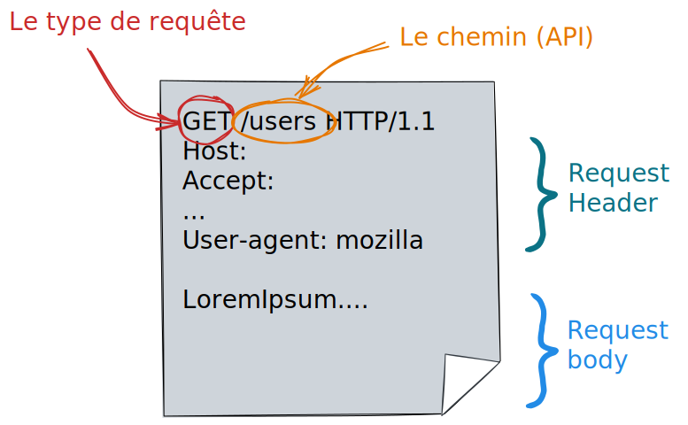
]

---

# Types de requêtes

Vous avez peut être remarqué le `GET`dans la requête précédente.

En gros c'est pour dire que l'on veut faire un requête de type `GET`. Sous-entendu il existe d'autre types de requête ...
<br> dans le monde HTTP(S) il existe:

- `GET` : requêtes pour **_obtenir_** du serveur une ressource (fichier html/css/js, image, video, données, ...)
- `POST` : requêtes pour **_envoyer_** des données au serveur en vu d'un traitement (ajout d'un utilisateur dans une base de données, ...)
- `PATCH` : requêtes pour **_modifier partiellement_** une ressource du serveur (mettre à jour l'addresse mail d'un utilisateur dans la base de données)
- `DELETE` : requêtes pour **_supprimer_** une ressource du serveur (supprimer un commentaire sur un article, ... )

Il s'agit là des principaux types de requêtes mais il en existe d'autres, pour la liste complète vous pouvez faire un tour ici
<https://fr.wikipedia.org/wiki/Hypertext_Transfer_Protocol>

.center[
⚠️ Il arrive souvent que `POST` soit utilisée, à la place de `PATCH`, <br> pour mettre à jour une donnée déjà présente côté serveur ... 🤢
]

---

# Expérimentons

Dans Python 🐍 vous vous en doutez il existe tout ce qu'il faut !!

```python
import requests
```

Nous allons utiliser le site <http://httpbin.org> qui met à disposition un serveur de test relativement utile.

.center[
le dossier `python/httpbin-client` du cours
<br>ou<br>
[http://bit.ly/3XmaLNE](http://bit.ly/3XmaLNE)
<br> ou <br>

]

---

# Les codes de retour

Lorsque l'on fait une requête à un serveur via http/https ce dernier nous renvoie en premier lieu un code de retour.

<br>
.center[Ces codes sont normalisés]
<br>
Voici un extrait non complet des codes possibles :

- 2xx : ok tout s'est bien passé ✅
  - normalement 200
- 3xx : redirect
  - 301/302 : redirection de la page, temporaire ou pas ⤴️
- 4xx: erreur
  - 401 : il faut s'authentifier 🔐
  - 403 : minute papillon tu n'as pas le droit d'accéder à ça ! ⛔
  - 404 : ce que tu me demandes n'existe pas ⁉️
- 5xx : la c'est un problème de serveur 💣

Et donc la première chose à faire lorsque vous faites une requête à un serveur c'est de vérifier que le code de retour est bien 200 car sinon pas la peine de continuer !

---

# La notion d'API

.center[Application Programming Interface]

Permet de définir comment un programme **consommateur** va pouvoir exploiter les **fonctionnalités** données d'un programme **fournisseur**

Dans le domaine particulier du Web l'API se définit en fait à partir d'une URL. En effet l'accès à la ressource se fait en effectuant une requête GET (ou POST, selon les cas) sur un url particulière.

--

.center[]

.footnote[Image from Jérémy Mésière, Architecte Middleware chez Manutan]

---

# API REST

.center[**Representational State Transfer**]

Ensemble de principes gouvernant l'architercture d'application Web.

.cols[
.fifty[

- **Méthodes HTTP** :

  Les opérations sont réalisées à l'aide des méthodes HTTP : GET (lire), POST (créer), PUT/PATCH (mettre à jour), DELETE (supprimer).
  Exemple : Une requête GET à l'API d'un blog pour récupérer un article spécifique.

- Ressources :

  Dans REST, toutes les données ou états sont considérés comme des "ressources".
  Chaque ressource est **identifiée de manière unique** par une URI (Uniform Resource Identifier).
  Exemple : /articles/123 peut représenter la ressource pour l'article avec l'ID 123.
  ]
  .fifty[

- Sans état (**Stateless**) :

  Chaque requête de l'API REST doit **contenir toutes les informations nécessaires** pour être comprise par le serveur. **Aucun état de session** n'est conservé sur le serveur.
  Avantages : Simplifie la conception du serveur et améliore la scalabilité.

- Représentation des ressources :

  Les ressources peuvent être représentées en différents formats, JSON et XML étant les plus courants.
  Le choix du format est souvent indiqué dans l'en-tête HTTP Content-Type de la requête.

  ]
  ]

---

# L'importance des headers HTTP

.center[
Les headers HTTP sont des paramètres envoyés dans les requêtes et réponses HTTP qui fournissent des informations essentielles sur la transaction HTTP.
]

Notamment cela va nous permettre de gérer l'authentification 🔐 lorsqu'on veut accéder à des API protégées, le format des données, la version de l'API

Quelques headers **_classiques_** :

- `Content-Type` : indique le type de média du corps de la requête ou de la réponse. Dans le cadre des API REST, `application/json` est couramment utilisé, indiquant que l'on ne travaille qu'avec du JSON.
  <br><br>
- `Accept` : le type de contenu que l'on accepte en réponse, généralement ̀`application/json` également
  <br><br>
- `Authorization` : on va voir dans la prochaine slide qu'il permet de gérer l'authentification lorsqu'on veut accéder à une ressource protégée

---

# Un mot sur l'authentification

Pour s'authentifier auprès d'une API REST, il faut à chaque requête fournir la preuve de qui l'on est. Cela passe généralement par l'association à la requète d'un token qui permet à l'application de savoir

.cols[
.fifty[

- Qui l'on est
- Ce que l'on a le droit de faire sur quelles ressources
  ]
  .fifty[

```bash
Authorization: Bearer <token>
```

]
]

L'obtention du token se fait généralement via l'interface Web du service visé.

.center[⚠️ Attention un token ne doit ***jamais*** être partagé 💣️]

Dans la plupart des cas à un token est associé :

- Un ensemble de ressources accessibles
- Les droits sur ces ressources (consultation, modification, création, suppression)
- Une durée de validité (date d'expiration du token)

.center[Une solution pour conserver les tokens d'une application est d'utiliser un fichier `.env`]

---

# Une API utilisable est une API documentée

Donc pour conclure sur les API, il s'agit d'un moyen très simple pour offrir une interface vers des ressources et données distantes. La seule difficulté dans ce domaine c'est la définition et surtout la **documentation des API** 📑. Donc si vous mettez en place un service Web disposant d'une API et que vous souhaitez ouvrir votre service vers l'extérieur merci de prendre le temps de documenter votre API.

On trouve en ligne plein d'API ouverte un lien pour avoir une liste non exhaustive

.cols[

.fifty[
.center[
[https://github.com/public-apis/public-apis](https://github.com/public-apis/public-apis)<br>
ou <br>
[http://bit.ly/3YHC1qX](http://bit.ly/3YHC1qX) <br>
ou <br>

]
]

.fifty[
.center[
notamment un exemple d'API utile<br> <https://adresse.data.gouv.fr/outils/api-doc/adresse>
]
]

]
---

# Illustration

Considérons par exemple le cas d'un serveur générant des listes de nombres aléatoires à la demande. L'api d'un tel serveur pourrait être

- `/api/integer` renvoie un nombre aléatoire entier
- `/api/float` renvoie un nombre aléatoire flottant
- `/api/integer?n=100` renvoie 100 nombres aléatoires entiers
- ...

.center[
le dossier `python/api-random` du cours
<br>ou<br>
[http://bit.ly/3HONIFN](http://bit.ly/3HONIFN)
<br> ou <br>

]

---

# Par exemple

.center[Générer quelques statistiques sur Github]

```md


```


---

# Un mot sur le "No Code"

Depuis quelques années de plus en plus à la mode: **No Code**, **Low Code**

.center[
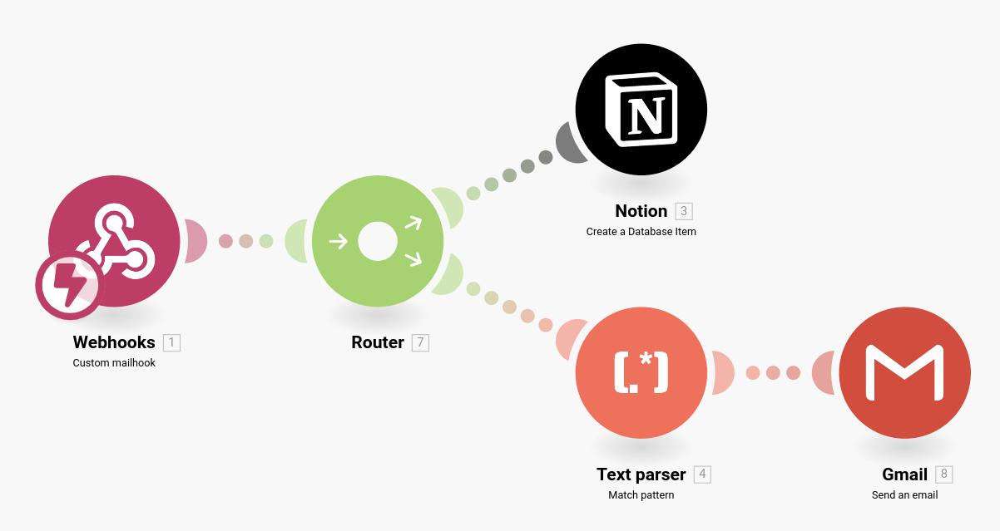
]

<br><br>
.center[demande de support par mail qui provoque une nouvelle entrée dans une base de données<br>et une notification par mail si "urgent" dans le sujet du mail 🤯]

---

# Application 1

Je vous ai mis en place un serveur minimaliste offrant une API permettant :

1. Lister l'ensemble des utilisateurs de la base de données
2. Mettre à jour votre status
3. Envoyer un message à un utilisateur
4. Récupérer les messages qui m'ont été envoyés.

.center[ 🚀 https://mines.bmarchand.fr/api/doc 🚀]

--

L'idée est que vous réalisiez les actions suivantes :

1. A l'aide d'un programme Python 🐍 :
   1. faire une requète `GET` permettant de trouver quel est votre ID d'utilisateur
   2. faire une requète `PATCH` pour mettre à jour votre status
   3. faire des requètes `GET`/`POST` pour vous envoyer des messages entre vous
2. Pour les plus joueurs, à l'aide du combo HTML/CSS/JS
   1. Faire le client web de ce serveur 🤗 !

---

# Application 2 : utilisation de l'API Notion

L'objectif ici est de mettre en place un programme Python permettant de modifier le contenu d'une base de données Notion. **[Un squelette est disponible ici](https://github.com/ue22-p24/backend-notion-api-skeleton)**. L'application à terme doit pouvoir :

.small[

.cols[
.sixty[

- Lister l'ensemble des tâches d'une base de données
- Afficher le détail d'une tâche défini par son ID
  ]
  .fifty[
- Changer le status d'une tâche
- Ajouter du texte dans la page de la tâche
  ]
  ]

.cols[
.fifty[
**Step 1️⃣** : créer une base de données dans Notion
.center[vous pouvez dupliquer [celle-ci](https://bmarchand.notion.site/04620d6c67274d8e96211ddc738acf76?v=31bcb2e38fa242cfbc8eb9c51eca6108)]

**Step 2️⃣** : créer une intégration Notion
.center[Se rendre sur le site [https://www.notion.so/my-integrations](https://www.notion.so/my-integrations) et créer une intégration]

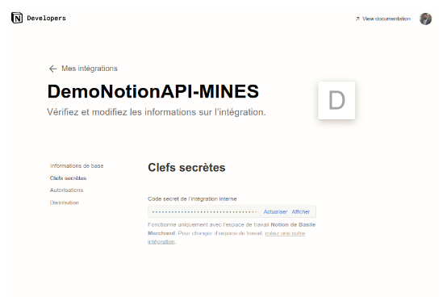

]

.fifty[
**Step 3️⃣** : ajouter la base de données à l'intégration créée précédemment
.center[depuis la page de la base de données]

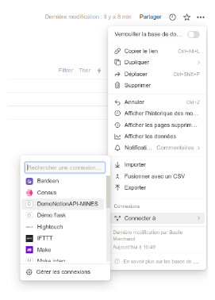

**Step 4️⃣** : récuper l'ID de la base de données

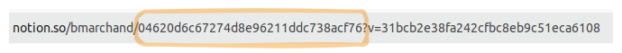

]
]

]
---

class: middle, center

# La semaine prochaine❕

## On passe du côté obscur <br> et on voit comment définir nos API

.center[
<iframe src="https://giphy.com/embed/6x4CLjC8KofaU" width="469" height="380" frameBorder="0" class="giphy-embed" allowFullScreen></iframe>
]
