# Framework web --- Flask !

## Récap des épisodes précédents

````{div}
:class: center
Architecture classique Client <-> Serveur avec des variations peer-to-peer, three-tier, ...
````

.cols[
.fourty[
````{div}
:class: center

````
]

.fifty[
 

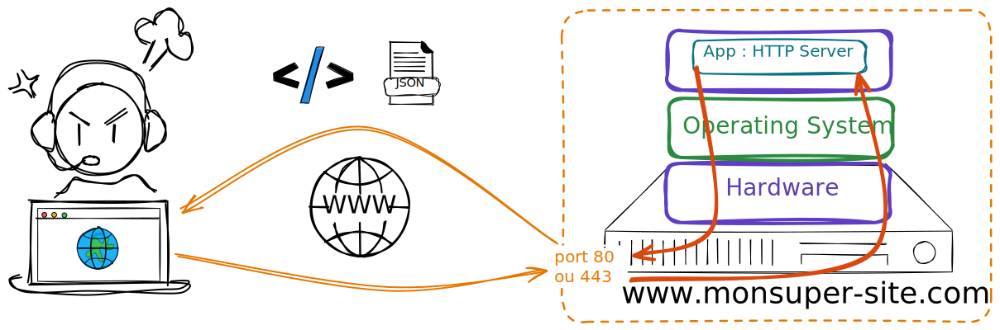
]

.twenty[
  <br><br>

<p style="font-size: 4rem"> 🍪 </p>
]
]

---

# Les frameworks

Réponse à un besoin mais lequel ?

````{div}
:class: center
***Cadre de développement simplifié***
````

En gros un guide <strike> spirituel </strike>, permettant de développer simplement des applications spécifiques.

````{div}
:class: center
<iframe src="https://giphy.com/embed/MZW5o8f5RaH0Q" width="480" height="197" frameBorder="0" class="giphy-embed" allowFullScreen></iframe>
````

---

# Framework vs Librairie

````{div}
:class: center
Frameworks, Librairies, même chose ? <br>
````

--

.cols[
.fifty[
````{div}
:class: center
<b> Librairies </b>
````

Ensemble de programmes effectuant des opérations spécifiques, que vous allez utiliser de manière ponctuelle au sein de vos programmes en suivant votre propre logique.

<br>

Par exemple `NumPy` en Python 🐍 est une librairie

````{div}
:class: center
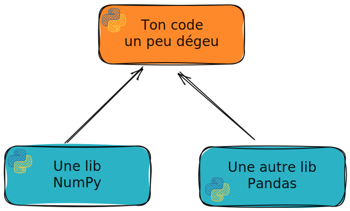
````

]
.vertbar[]
.fifty[
````{div}
:class: center
<b> Framework </b>
````

Cadre de développement dans lequel le développeur vient s'inscrire, i.e. développer des fonctionnalités/comportements. Là ce n'est plus le développeur qui fixe sa logique mais le framework.

<br>

Un code à trou 🕳️ en quelque sorte - comme `arcade`

````{div}
:class: center
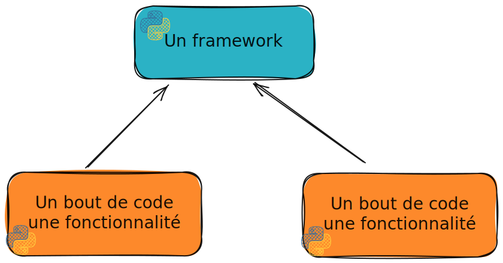
````

]
]

---

# Frontend, backend

````{div}
:class: center
⚠️ Framework web un terme très, trop, générique ⚠️
````

.cols[
.fifty[

````{div}
:class: center
Framework frontend
````

````{div}
:class: center
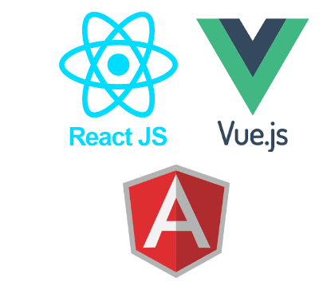
````

Focalisé sur le développement d'application côté client.

]
.vertbar[]
.fifty[

````{div}
:class: center
Framework backend
````

````{div}
:class: center
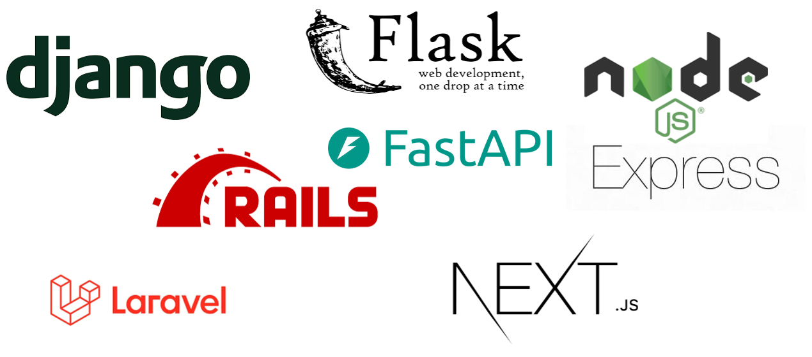
````

Focalisé sur le développement côté serveur

]
]

Dans le cadre de ce cours on ne se focalisera que sur le côté `backend`

---

# Les grands principes des framework backend

````{div}
:class: center
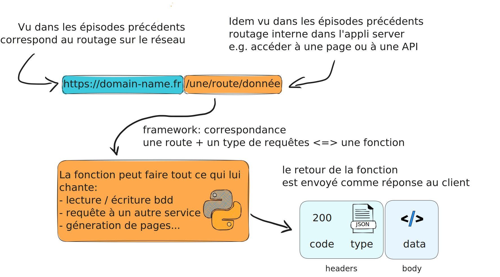
````

À cela un framework complet ajoute des fonctionnalités de :

````{div}
:class: center
`Web Template`, `Sécurité`, `Accès à des bases de données`
````

---

# Framework Flask

Micro-framework Python 🐍 développé depuis 2010.
<br><br>
````{div}
:class: center

````
<br><br>
🚧 Micro-framework ne veut pas dire pas utilisable sur des gros projets ⚠️
<br><br>
````{div}
:class: center
Pinterest, Airbnb, Trivago, ...
````
<br><br>
Micro-framework car noyau très léger et minimaliste mais pouvant être enrichi avec des extensions.

---

# Pourquoi Flask et pas autre chose

1️⃣ Vous savez tous à peu prêt faire du Python 🐍

````{div}
:class: center
donc on élimine tout ce qui n'est pas à base Python
````

--

2️⃣ On va essayer de vous apprendre des trucs utilisés par ailleurs

````{div}
:class: center
<figure>
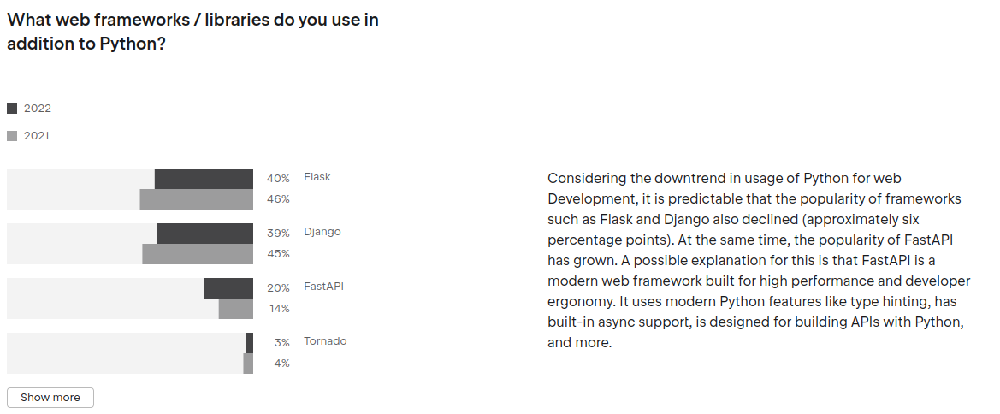<br>
<label style="font-size: x-small"> Source: <a href="https://www.jetbrains.com/lp/devecosystem-2022/python/">https://www.jetbrains.com/lp/devecosystem-2022/python/</a>
</figure>
````

.footnote.small[
  Notez bien que tout ça est extrêmement difficile à mesurer par ailleurs - par exemple, on parle de quelle unité ?  
  Il reste toutefois que la tendance FastAPI semble effectivement être à la hausse.
]

---

class: middle, center

# Mais au fait ...

# ... pourquoi on s'intéresse à ça ?

---

# Graphical User Interface

Faire le pont 🌉 entre :

````{div}
:class: center
un code de calcul/traitement de donnée/...

et

une interface graphique
````

Deux approches :

.cols[
.fifty[
````{div}
:class: center
***Old school***
````

Utilisation de librairies graphiques et développement d'un client lourd

````{div}
:class: center
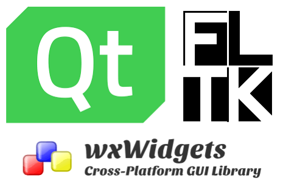
````

]
.vertbar[]
.fifty[
````{div}
:class: center
***New age***
````

Utilisation du navigateur

````{div}
:class: center
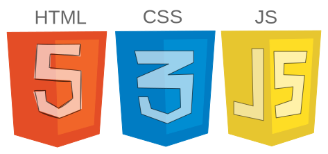
````

]
]

<div style="transform: rotate(40deg); opacity: 0.9;position: absolute; right: 10%; top: 25%; border: 1px solid darkblue; border-radius: 10px; padding: 2pt 10pt; background-color: aliceblue;">
<p style="opacity: 1; color: crimson; font-weight: bold; background-color: aliceblue"> Projets d'informatique ... </p>
</div>

---

# Une première app

## Installation

Pour commencer on installe `Flask`

```bash
pip install flask
```

Vous pourrez alors travailler en local 💻️. 

.small[
  Au besoin si vous voulez vous mettre dans une configuration serveur vous pouvez utiliser [@Replit](https://replit.com) il y a un template Flask.
]

````{div}
:class: center
Et rien de plus à faire 😯 <br>
<br><br>
c'est l'avantage de Flask par rapport à Django <br> qui nécessite un setup plus poussé pour démarrer un projet
````

---

# Minimal Working Example

.cols[
.fifty[
  - Step 1️⃣ :

```python
from flask import Flask
```
]

.fifty[
- Step 2️⃣

```python
app = Flask("Appli de ouf")
```
]
]

Ensuite tout repose sur une syntaxe un peu particulière :

```python
*@app.route("/une/url/cible")
def la_fonction_correspondante():
  // fait des trucs très intelligents
  // et encore plus
  return un_resultat ## pouvant être du html, du json, ....

```

Pour finir :
.cols[
.fifty[

```python
app.run(debug=True, port=3001)
```

]
.fifty[
`debug=True` permet d'activer du hot reloading
]
]

---

# Pour ceux qui auraient la flemme !

.cols[
.sixty[
````{div}
:class: center
<iframe src="https://giphy.com/embed/4KkSbPnZ5Skec" width="471" height="480" frameBorder="0" class="giphy-embed" allowFullScreen></iframe>
````

]
.fourty[
[http://bit.ly/3Z5C5k7](http://bit.ly/3Z5C5k7)

````{div}
:class: center

````
]
]

---

# Envoyer autre chose qu'une chaine !

Si on veut pour une url donnée renvoyer, non pas une chaîne, mais un fichier HTML qui lui même peut nécessiter des CSS/JS, il va falloir une organisation un peu particulière

.cols[
.fifty[

```bash
.
├── app.py
├── static
│   ├── css
│   │   └── wheel.css
│   └── js
│       └── wheel.js
└── templates
    └── wheel.html
```

]
.fifty[

```python
from flask import render_template
```

```python
@app.route("/")
def index():
  return render_template("wheel.html")
```

]
]

En revanche tous les fichiers contenus dans le dossier `static` seront
**automatiquement accessibles** sans que l'on ait rien à faire et ça c'est 🆒 !

---

# Un truc un tout petit peu plus évolué

## Passage de paramètres aux URLs

````{div}
:class: center

````

Besoin de récupérer dans la fonction `handler` la requête et donc ses arguments 🤔

````{div}
:class: center
Flask a tout prévu
````

.cols[
.sixty[

```python
from flask import request

@app.route("/une/route/donnee")
def handler():
  name = request.args.get("name")
  age = request.args.get("age")
  return f"<h1> Hello {name} ! Tu as vraiment {age} ans ? </h1>"
```

]
.fourty[
⚠️ Si l'argument n'existe pas la fonction `get` retourne `None`
]
]

````{div}
:class: center
🚧 Pas de notion de type dans les arguments, tout est chaîne de caractère 🚧
````

---

# URL paramétrique

Possibilité offerte par Flask de définir des paramètres au sein même d'une URL

````{div}
:class: center
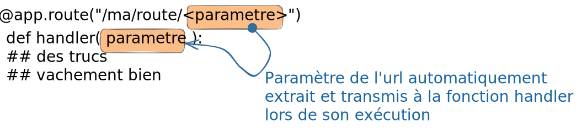
````

.cols[
.fifty[
Possibilité de typer les paramètres :

- `string` : pour tout texte sans slash
- `int` : valeur entière positive
- `float` : valeur flottante positive
- `path` : un string qui peut contenir un slash `/`

]
.fifty[

```python
@app.route("/home/<int:user_id>")
def home_uid(user_id):
    ## do something according to user_id value
    return f"we were passed {user_id}"
```

]
]

.footnote.small[

  bien sûr on peut aussi recevoir comme ça plusieurs paramètres

]
---

# Un exemple : générateur de nombre aléatoire

API de génération de nombres aléatoires

- `/api/integer` : génère des entiers
- `/api/float` : génère des flottant

Possibilité pour les deux d'ajouter un paramètre `n` par exemple `?n=10` pour générer 10 valeurs alétoires.

```{div}
:class: center
[http://bit.ly/3nb0yaG](http://bit.ly/3nb0yaG)
```

````{div}
:class: center

````

---

# Une API complète

Petit rappel du 1er épisode, HTTP différentes requêtes possibles

- `GET` : requêtes pour **_obtenir_** du serveur une ressource (fichier html/css/js, image, video, données, ...)
- `POST` : requêtes pour **_envoyer_** des données au serveur en vu d'un traitement (ajout d'un utilisateur dans une base de données, ...)
- `PATCH` : requêtes pour **_modifier partiellement_** une ressource du serveur (mettre à jour l'addresse mail d'un utilisateur dans la base de données)
- `DELETE` : requêtes pour **_supprimer_** une ressource du serveur (supprimer un commentaire sur un article, ... )

Il s'agit là des principaux types de requêtes mais il en existe d'autres, pour la liste complète vous pouvez faire un tour [https://fr.wikipedia.org/wiki/Hypertext_Transfer_Protocol](https://fr.wikipedia.org/wiki/Hypertext_Transfer_Protocol).

````{div}
:class: center

````

.footnote[Image from Jérémy Mésière, Architecte Middleware chez Manutan]

---

# Spécification des requêtes

Une même fonction pour un chemin, mais pour différents types de requête (e.g. GET et POST)

```python
from flask import request

@app.route("/chemin", methods=['GET', 'POST'])
def the_function():
  if request.method == "POST":
    ## do something for post
    return post_response
  elif request.method == "GET":
    ## do other thing
    return get_response
```

Mais on peut aussi faire: une fonction par chemin et par type de requête

```python
@app.get("/chemin")
def get_for_chemin():
  return

@app.post("/chemin")
def post_for_chemin():
  return
```

---

# Récupérer les données reçues

````{div}
:class: center
Encore une fois tout se passe dans `request`
````

Plusieurs méthodes à disposition :

- `request.is_json()` pour vérifier qu'il y a bien du json dans la requête
- `request.get_json()` qui retourne le contenu de la requête

````{div}
:class: center
⚠️ Lorsque vous traitez une requête `POST` il faut impérativement que votre fonction renvoie quelque chose ⚠️
````

```{div}
:class: center

[http://bit.ly/40ly786](http://bit.ly/40ly786)


```

---

# Servir des pages HTML

Deux cas de figures :

- Réponses "statiques" -> contenu ne dépendant de rien donc le plus simple en fait

````{div}
:class: center
<iframe src="https://giphy.com/embed/Rl9Yqavfj2Ula" height="250" frameBorder="0" class="giphy-embed" allowFullScreen></iframe>
````

--

- Réponses "dynamiques" -> contenu dépendant de données externes (base de
  données typiquement, paramètres utilisateur... )

````{div}
:class: center
Page profil utilisateur, recherche de produits selon critères, ...
````

---

# Fichies dynamique : CSR vs SSR

Pour le cas de pages dynamiques deux approches existent

````{div}
:class: center
**C**lient **S**ide **R**endering
<br><br> vs <br><br>
**S**erver **S**ide **R**endering
````

````{div}
:class: center
<iframe src="https://giphy.com/embed/QYMBnZjnxko0eCzBuF" width="480" height="270" frameBorder="0" class="giphy-embed" allowFullScreen></iframe>
````

---

# Une démo

```{div}
:class: center
[http://bit.ly/3Tx8wqL](http://bit.ly/3Tx8wqL)
```

````{div}
:class: center

````

Il faut être curieux et ouvrir l'onglet "Network" des outils de développement du navigateur !

---

# Approche CSR

````{div}
:class: center

````

---

# Approche SSR

````{div}
:class: center

````

````{div}
:class: center
Besoin d'un mécanisme de ***génération de page HTML***
````

---

# Moteur de template

Mécanisme de génération de page HTML à partir d'un modèle et de données.

````{div}
:class: center
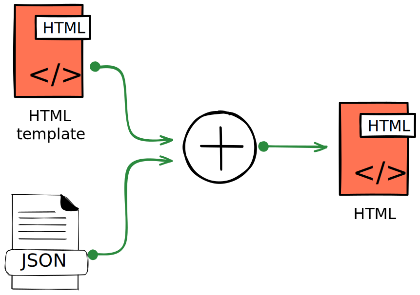
````

Plusieurs techno/solutions :

````{div}
:class: center
***Jinja2***, **Pug**, **Mustache**, **Ejs**
````

---

# Jinja 2

Moteur de template Pythonique 🐍

Lien avec Flask via la fonction `render_template`

```python
from flask import render_template
```

Que l'on utilise dans les fonctions de routage

```python
@app.route("/")
def index():
  context = {}
  ### do something
  return render_template("templated_html.html", **context)
```

Où `context` est un dictionnaire Python contenant les variables que l'on souhaite transmettre de notre application Flask au moteur de template.

---

# Jinja 2

## Substitution de variables

Pour afficher dans le HTML le contenu d'une variable il faut entourer cette dernière par des doubles accolades dans du code HTML.

```html
<div>Bonjour {{ name }}</div>
```

---

# Jinja 2

## Blocs conditionnels

Pour choisir d'afficher ou nom une partie de la page HTML  
vous pouvez utiliser des branchements de type `` `` ``  
La syntaxe est la suivante

```html
*
<div>du html en pagaille</div>
*
<div>un autre fouillis de html</div>
*
<div>le html par défaut</div>
*
```

_Remarque_ le `None` de Python se transforme en `none` dans Jinja2

---

# Jinja 2

## Boucles for

L'intérêt majeur étant l'affichage dynamique de tableau.  
Les boucles `` dans Jinja2 vous permettent d'itérer sur tout objet Python itérable  
 La syntaxe est la suivante

```html
*
<div>Iteration {{ x }}</div>
*
```

---

# Jinja 2 et accès dans un dictionnaire

si `x` est lui même un dictionnaire, on peut accéder à ses clés/valeurs via e.g. `x.name` ou `x['name']`, le premier étant généralement plus pratique  

```html

<div>Iteration
*  {{ x.name }}
  et
*  {x['age']}
</div>

```

voyez `python/jinja-demo.py` pour un exemple exécutable

---

# Synthèse CSR vs SSR

Deux modes avec des avantages et inconvénients

Grosso modo

- CSR c'est cool pour

````{div}
:class: center
Avoir des pages avec beaucoup d'interaction,<br><br>notamment lorsque l'on est plus sur de l'appli web que du site web
````

- SSR c'est bien pour

````{div}
:class: center
accélérer le chargement initial de votre site, si vous avez peu d'interaction avec l'utilisateur,<br><br>si vous souhaitez optimiser votre référencement naturel dans les moteurs de recherches.
````

Et d'un point de vue très pragmatique
````{div}
:class: center
peut dépendre également du confort que vous avez à programmer en Python ou Javascript
````

---

# Jinja2 plein d'autres choses

On a survolé les fonctionnalités de base de Jinja mais il y a plein de trucs *advance* super pratiques

[https://jinja.palletsprojects.com/en/3.1.x/templates/](https://jinja.palletsprojects.com/en/3.1.x/templates/)

Liste non exhaustive :

- Composition de template par héritage 
  - pour emboiter les templates les uns dans les autres
- Filtres 
  - pour formater les données
- Définition de macros
  - un peu comme des fonctions en Python

---

# Gestion des formulaires avec Flask

Un truc récurrent dans le web c'est les formulaires :

- Authentification
- Messagerie
- Interface utilisateur
- ...

<br><br>
Un besoin

````{div}
:class: center
Spécifier les champs (nom et nature/type) ; agréger les données saisies par l'utilisateur ; envoyer ces données au backend ; traiter ces données et émettre une réponse
````

Un module tout fait en Python WTForm et son interface pour Flask FlaskWTF

```bash
pip install flask-wtf
```

<div style="position: absolute; top: 22%; left: 25%">
<iframe src="https://giphy.com/embed/26FPJGjhefSJuaRhu" width="480" height="200" frameBorder="0" class="giphy-embed" allowFullScreen></iframe>
</div>
<div style="position: absolute; top: 13%; right: 8%">
<iframe src="https://giphy.com/embed/xT5LMUv1JAxBiCft4I" width="480" height="200" frameBorder="0" class="giphy-embed" allowFullScreen></iframe>
</div>

---

# Principes

L'utilisation de Flask-WTF se fait en définissant son propre formulaire en créant une classe héritant de la class `FlaskForm`.

```python
from flask_wtf import FlaskForm
```

Par exemple un formulaire de login pourrait s'écrire de la manière suivante :

```python
from wtforms import StringField, PasswordField, BooleanField, SubmitField
from wtforms.validators import DataRequired

class LoginForm(FlaskForm):
    username = StringField('Username', validators=[DataRequired()])
    password = PasswordField('Password', validators=[DataRequired()])
    submit = SubmitField('Sign In')
```

---

# Les types input

.cols[
.fifty[
Les différents types prédéfinis dans `WTForm` sont les suivants :

- `BooleanField` : représente un booléen
- `IntegerField`
- `FloatField`
- `DecimalField`
- `SelectField` : choix parmi une liste d'option
- `DateField` : représente une date
- `FileField` : pour la sélection de fichier
- `MultipleFileField` : pour la sélection multiple
- `PasswordField` : champ pour le mot de passe (affiche des étoiles)
- `TextAreaField` : champ de saisie de texte libre
- `SubmitField` : le bouton de soumission du formulaire
  ]
  .fifty[

Possibilité d'ajouter des "validateurs"

- `DataRequired` : champs obligatoire
- `Email` : le champs est une adresse email
- `EqualTo` : test d'égalité
- `NumberRange` : valeur numérique dans un intervalle
- `Optional` : champs optionnel

]
]

--

<div style="position: absolute; bottom: 10%; right: 5%; transform: rotate(20deg)">
<iframe src="https://giphy.com/embed/lPF1CyJXXcTZmUrP2J" width="480" height="200" frameBorder="0" class="giphy-embed" allowFullScreen></iframe>
</div>

---

# Utilisation en lien avec les templates

.cols[
.fifty[

```html
<html>
  <head>
    <title>Flask WTF</title>
  </head>
  <body>
    <hr />
    <h1>Sign In</h1>
    <form action="" method="post" novalidate>
      {{ form.hidden_tag() }}
      <p>
        {{ form.username.label }}<br />
        {{ form.username(size=32) }}
      </p>
      <p>
        {{ form.password.label }}<br />
        {{ form.password(size=32) }}
      </p>
      <p>{{ form.submit() }}</p>
    </form>
  </body>
</html>
```

]
.fifty[
La méthode `form.hidden_tag` va générer une ligne du genre :

```html
<input
  id="csrf_token"
  name="csrf_token"
  type="hidden"
  value="ImI0ODg5NjE3NzdiYjM5NWJlZWRiYzE3MDlmZjBhNjFkMDhlMjE4M2Ii.Xq_IiQ.GG9q2vWBhqbZGuGGJue2MwDIQwI"
/>
```

Aucun intérêt fonctionnel. En revanche utile pour la sécurité 🚨 et se prémunir des attaques type
<br><br>
````{div}
:class: center
**C**ross **S**ite **R**equest **F**orgery
````

Et ça demande de définir une clé secrete
 `app.config['SECRET_KEY'] = os.urandom(32))`
]
]

---

# Données du formulaire dans les *handlers*

On peut directement réutiliser la classe `LoginForm` dans nos fonctions *handler* par exemple :

```python
@app.route("/", methods=['GET', 'POST'])
def login():
    form = LoginForm()
    if form.validate_on_submit():
        print(f"Log in requested for {form.username.data} with password {form.password.data}")
        ## Add function here to check password

        return redirect("/home")
    return render_template("login.html", form=form)
```
.cols[
.sixty[

Remarques
- `login.html` doit être dans un répertoire `/templates`
- son extension doit être `.html`, `.htm`, `.xml`, `.xhtml`, ou `.svg`

  ]

.fourty[
```{div}
:class: center
[http://bit.ly/3JyTBb2](http://bit.ly/3JyTBb2)


```
]
]

---

# Un petit bonus : les Cookies 🍪

.cols[
.fifty[

```python
@app.route('/route/install/cookie')
def handler():

  resp = make_response(render_template('mapage.html'))
  resp.set_cookie('cookie', "eat me")

  return resp
```

]
.fifty[

```python
@app.route('/route/read/cookie')
def handler():
   name = request.cookies.get('cookieName')
   # ...
```

]
]

Par exemple, nombre de fois qu'on visite une page !


```{div}
:class: center
[http://bit.ly/408GbcF](http://bit.ly/408GbcF)


```

---

# Un mot sur la notion de `Session`

Très souvent besoin de la notion de session utilisateur

````{div}
:class: center
Stocker des infos spécifiques à un utilisateur entre deux requêtes
````

Possible de faire ça à la main 🖖🏻 à l'aide de cookies 🍪 ...

````{div}
:class: center
mais Flask peut tout faire à votre place
````

.cols[
.fourty[

```python
from Flask import session
```

Besoin d'un peu de config par contre

```python
app.config["SECRET_KEY"] = "un secret"
```

]
.sixty[

```python

@app.route("/une/url/<string:username>")
def handler( username ):
  session["name"] = username
  return "Ok j'ai enregistré"

@app.route("/")
def index():
  name = session.get("name")
  if name:
    return f"Hello {name}"
  else:
    return ("Merci de faire d'abord une requête"
            " vers /une/url/<username>")
```

]
]

<div class="center" style="position: absolute; top: 10%; right: 5%">

<a href="http://bit.ly/3JYyboX">http://bit.ly/3JYyboX</a>
<br>

</div>

---

# Et les websocket ...


.cols[
.fifty[
Petit rappel au cas où ...
<br><br>
````{div}
:class: center
connexion **bidirectionnelle** entre un client et le serveur
<br><br>on parle de connexion *full-duplex*
<br><br>Permet au serveur de ***pousser*** des informations vers le client sans que ce dernier n'ait rien demandé 😲
````
]
.fifty[
````{div}
:class: center
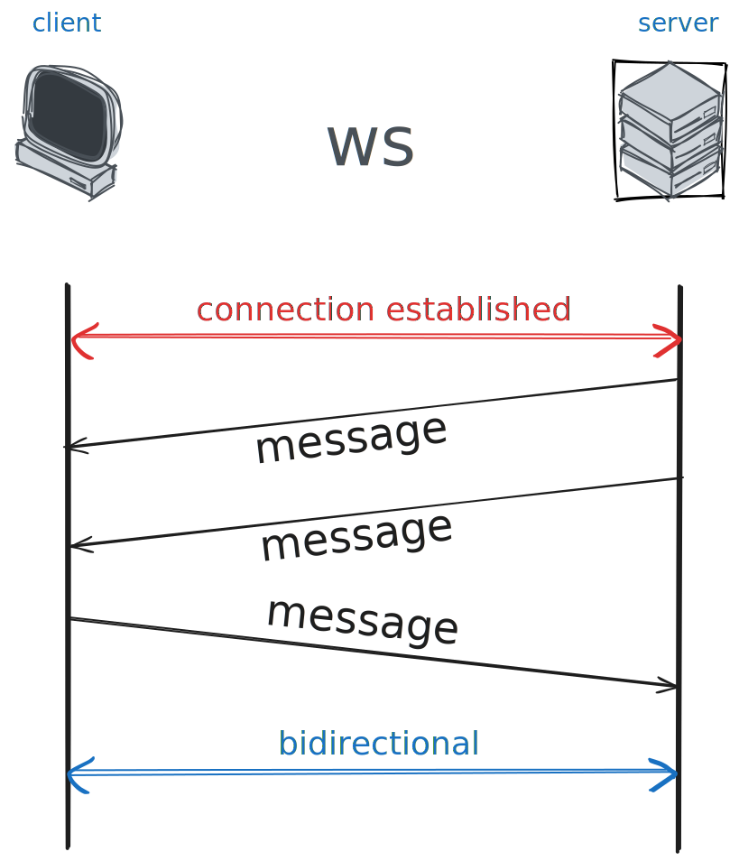
````
]
]

---

# Utilisation des Websocket

Un module dédié dans Flask

```bash
pip install flask-socketio
```

L'utilisation de websocket avec Flask se fait de manière très simple. Il suffit tout d'abord de créer notre serveur websocket à l'aide de la classe `SocketIO` que l'on attache à notre application Flask.

```python
from flask_socketio import SocketIO
socketio = SocketIO(app)
```

Ensuite rien de révolutionnaire on enregistre des fonctions pour des `events` donnés

```python
@socketio.on('message')
def handle_message(json):
    print('received my event: ' + str(json))
    socketio.emit('my response', json)
```

---

# Exemple de Chat Flask + SocketIO

.cols[
.fifty[

```python
from flask import Flask, render_template
from flask_socketio import SocketIO

app = Flask(__name__)
socketio = SocketIO(app)

@app.route('/')
def sessions():
    return render_template('session.html')

@socketio.on('receive_msg')
def handle_my_custom_event(json):
    print('received my event: ' + str(json))
    socketio.emit('the_response', json)

```

.left[
Possibilité d'ajouter par dessus la notion de `room` <br>
pour une gestion plus fine des destinataires
<br>
````{div}
:class: center
📥️ 📤️
<http://bit.ly/3yVAEdt> 


````
]
]

.fifty[

```js
let socket = io.connect(
    "http://" + document.domain + ":" + location.port);
$("form").on("submit", (e) => {
  e.preventDefault();
  let user_name = $("input.username").val();
  let user_input = $("input.message").val();
  socket.emit("receive_msg", {
    user_name: user_name,
    message: user_input,
  });
  $("input.message").val("").focus();
});
socket.on("the_response", (msg) => {
  if (typeof msg.user_name !== "undefined") {
    $("h3").remove();
    $("div.message_holder").append(
      '<div><b style="color: #000">' +
        msg.user_name +
        "</b> " +
        msg.message +
        "</div>"
    );
  }
});
```

]

]

---

# Tout ce qu'on ne peut pas voir

````{div}
:class: center
🚀 Cours en mode express 🚀
````

Plein de choses que l'on ne peut pas voir :

````{div}
:class: center
Authentification, gestion de base de données,<br><br>sécurité des applications web, interface avec services externes, ...
````

**Quelques ressources**

```{div}
:class: center
[https://flask.palletsprojects.com/en/1.1.x/](https://flask.palletsprojects.com/en/1.1.x/)

[https://blog.miguelgrinberg.com/post/the-flask-mega-tutorial-part-i-hello-world](https://blog.miguelgrinberg.com/post/the-flask-mega-tutorial-part-i-hello-world)
```

---

# Juste un mot quand même sur l'aspect Base de Données

Pour faire de la base de données relationnelle simplement

````{div}
:class: center
SQLAlchemy
````

Avec une intégration Flask assez simple via `Flask-SQLAlchemy`

Après dans le cas où vous avez besoin d'une base de données `simple` pour faire de la lecture/écriture minimaliste une solution :

````{div}
:class: center
Passer par un service externe
````

Trucs à la mode : Notion ou Airtable par exemple

---

# Flask SQLAlchemy

```bash
pip install Flask-SQLAlchemy
```

````{div}
:class: center
Gestion de base de données se fait via des **modèles**
<br><br>
Dans le jargon, ça s'appelle un ORM (Object-Relationship-Model)
<br><br>
Mais vous allez voir c'est beaucoup plus simple que ce qu'on vous a dit en prépa 😅
````

.footnote[il y a plein d'autres ORMs utilisables avec Flask, mais SQLAlchemy est le plus populaire]

---

# La tables des "User"

```python
*class User(db.Model):
    id = db.Column(db.Integer, primary_key=True)
    username = db.Column(db.String(80), unique=True, nullable=False)
    email = db.Column(db.String(120), unique=True, nullable=False)

    def __repr__(self):
        return f'<User {self.username}>'
```

```python
app.config["SQLALCHEMY_DATABASE_URI"] = "sqlite:///project.db"

db = SQLAlchemy(app)

```
 
Pour initialiser et remplir la base de données

```python
db.init_app(app)
with app.app_context():
    db.create_all()
    db.session.add(User(username="bob", email="bob.leponge@maison-ananas.com"))
    db.session.add(User(username="patrick", email="patrick.etoile@maison-ananas.com"))

   db.session.commit()
```

---

# Interogation de la base de données

**Liste de tous les utilisateurs**

```python
@app.route("/list")
def list():
*   users = User.query.all()
    output = [f"{user.username} ({user.email})" for user in users]
    return "<pre><code>" + "<br>".join(output) + "</pre></code>"
```

**Recherche d'un utilisateur**

```python
@app.route("/get/<string:username>")
def get_user(username):
*    user = User.query.filter_by(username=username).first()
    if user is None:
        return "<h1>User not found</h1>"
    return f"<h1>{user.username} ({user.email})</h1>"
```

---

# La table des "Post"

Ajout d'une classe Post (au sens message publié, pas de rapport avec le POST de http hein)

On a besoin d'une relation entre les deux tables, puisqu'un Post est lié à un utilisateur

```python
class Post(db.Model):
    id = db.Column(db.Integer, primary_key=True)
    title = db.Column(db.String(80), unique=True, nullable=False)
    content = db.Column(db.String(120), unique=True, nullable=False)
    user_id = db.Column(db.Integer, db.ForeignKey('user.id'), nullable=False)
*   user = relationship("User", back_populates="posts")
```

Du coup, besoin d'ajouter également une relation dans la classe User

```python
class User(db.Model):
    id = db.Column(db.Integer, primary_key=True)
    username = db.Column(db.String(80), unique=True, nullable=False)
    email = db.Column(db.String(120), unique=True, nullable=False)
*   posts = relationship("Post", back_populates="user")
```

---

# Utilisation

```python
@app.route("/posts")
def posts():
    posts = Post.query.all()
    output = [f"{post.title} ({post.content}) from {post.user.username}" for post in posts]
    return "<pre><code>" + "<br>".join(output) + "</pre></code>"

@app.route("/post/<string:username>")
def get_posts(username):
    user = User.query.filter_by(username=username).first()
    if user is None:
        return "<h1>User not found</h1>"
    posts = user.posts
    output = [f"{post.title} ({post.content})" for post in posts]
    return "<pre><code>" + "<br>".join(output) + "</pre></code>"
```

````{div}
:class: center
Ainsi toute la science occulte de la base de données relationnelle
<br><br>est cachée derrière des classes Python 🐍
````

---

# Une appli complète

Voyez la construction pas à pas d'une appli de chat minimaliste, mais fonctionnelle, sur
[backend-chatapp.surge.sh](https://backend-chatapp.surge.sh/scrollycoding)

---

class: middle

# Dans le prochain épisode ...

--

````{div}
:class: center
<iframe src="https://giphy.com/embed/Xd6Y9TuDtylt5ug5PC" width="480" height="260" frameBorder="0" class="giphy-embed" allowFullScreen></iframe>
````
