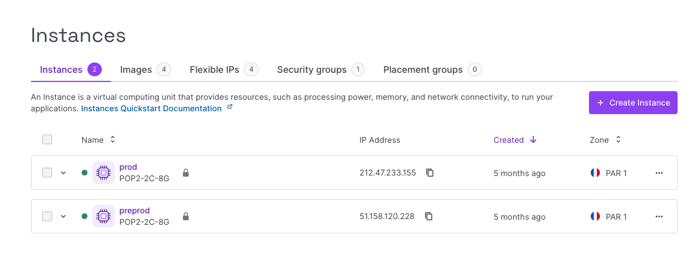
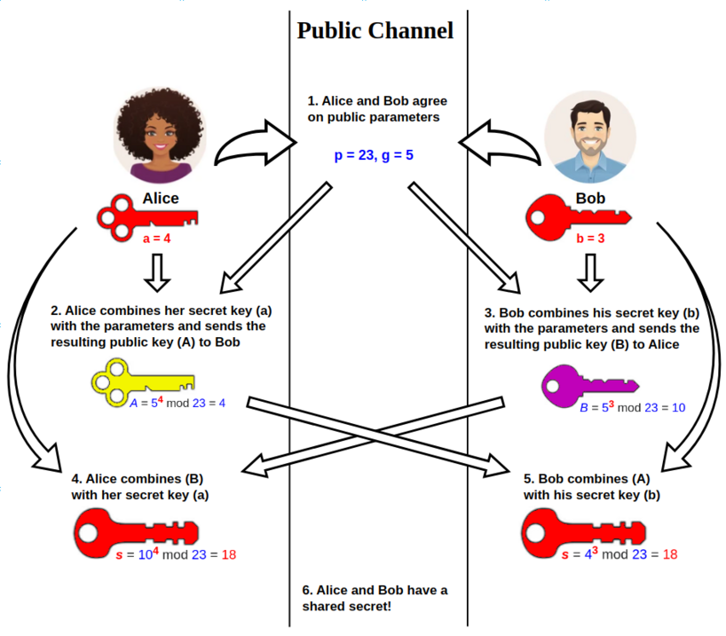

class: middle, slide_title


<!--  -->


# Additional slides !

---

layout: true


<!--  -->

<div class="slide_footer">
    <div class="wrap">
        <span>2025 - <i> Réseaux & Backend</i>
        - <a href="slides1.html">1/3: Réseaux</a>
        - <a href="slides2.html">2/3: Coté Serveur!</a>
        - <a href="slides3.html">3/3: Flask</a>
        - <a class="current-slides" href="slides4.html">4: Addendum</a>
    </div>
</div>

---

# 🔐 Web Authentication Techniques

## Session-based Authentication

- User submits login credentials
- Server creates a session and stores it in memory or DB
- Server sends a session ID as a cookie

Example:

```http
POST /login
→ Set-Cookie: session_id=abc123
```
    
Subsequent requests include the session ID:

```http
GET /profile
Cookie: session_id=abc123
```
    
---

## API Key Authentication

- Simple string used to authenticate requests
- Often used for server-to-server communication
- You typically get the API key when you register with the service
  - e.g. google maps, assemblyAI, scaleway, etc..

Example:

```http
GET /data
x-api-key: abc123xyz456
```

---

## Token-based Authentication (JWT)

- User logs in, receives a signed JWT
- Client stores token (e.g., in localStorage)
- Token sent in headers with each request
- Token is parsable and self-contained

Example:

```http
 GET /profile
Authorization: Bearer eyJhbGciOi...
```

---

# 🔗 OAuth 2.0

## 4. OAuth (Delegated Access)

- Used for "Login with Google" / "Login with GitHub"
- User authorizes third-party app via identity provider

Basic flow:

1. App redirects to provider’s auth page
2. User logs in and consents
3. Provider redirects back with a `code`
4. App exchanges code for access token

Example exchange:

```http
POST /oauth/token
→ { "access_token": "abc123" }
```

---

# 🔒 Multi-Factor Authentication (MFA)

## 5. Multi-Factor Authentication

- Adds extra layer beyond just passwords
- Combines two or more of:
  - Something you know (password)
  - Something you have (phone, token)
  - Something you are (biometrics)

Examples:
- SMS or app-based 6-digit codes
- U2F hardware keys (e.g. YubiKey)

    > Enter 6-digit code: 493021

Greatly reduces the risk of compromised accounts

---

## 🔑 Public Key Infrastructure (PKI)

.cols[
  .sixty[

- each browser and OS comes with a list of trusted CAs
  - CA = Certificate Authority
  - in practical terms, their public key
  - e.g. Verisign, Let's Encrypt, etc..
- a certificate is a chain of trust
  - signed by a CA
  - which in turn is signed by another CA
  - and so on until we reach a self-signed root CA
  - which should be trusted by the browser
- like always, signing is based on a public/private key pair
  - the CA signs the certificate with its private key
  - and the browser verifies it with the CA's public key
  ]

.fourty[
  
]
]

.footnote.small[
  try it: in chrome, you can inspect the certificate chain by clicking on the lock icon in the address bar; then choose "Connection is secure" and "Certificate is valid"
]

---

## FastAPI

- similar to Flask on the surface
  - but much more modern !

- fosters a more structured approach
  - uses SQLModel for ORM
  - you can define separate models for creating, reading, updating, etc.
  - useful e.g. for password hashing (not exposed)

- leverages type information (type hints / pydantic)
  - and in particular, automatically generates **interactive documentation**

- has native support for asynchroneous programming

- as well as websockets

---

## Docker: a container engine

- what is a container ? think of it as:

  - a root image (filesystem)
  - a set of processes (process group)
  - a network namespace (IP address)

- in short, it is a *lightwight* virtual machine
  - except that it **shares the kernel** with the host OS

- an app vendor can package their app
  - with all its dependencies
  - and ship it as a container image

- so in pratical terms:
  - instead of running a service inside an OS, you run it **inside a container**
  - e.g. you can run a linux-based nginx server inside a container in a Windows machine
  - **note** there are some gory tricks at work (does WSL rings a bell ?)

---

## CI/CD

### Continuous Integration / Continuous Deployment

- CI/CD is a set of practices that enable development teams to deliver code changes more frequently and reliably

- CI focuses on automating the integration of code changes from multiple contributors into a single software project

- CD automates the deployment of code changes to production

- example : github actions
  - look at the `.github/workflows` folder

- example: readthedocs (continuous documentation)
  - in the numerique course, see the `.readthedocs.yaml` file

---

## Hosting

many online solutions are available for hosting your web apps

- static hosting
  - surge.sh
  - netlify
  - vercel

- CI/CD
  - github pages (often powered by github actions)
  - readthedocs.io
  - ...

---

## Cloud operators

Many operators offer cloud services

- AWS
- Google Cloud
- Azure
- Digital Ocean
- Scaleway
- OVH
- etc..

---

## Cloud offerings

- metal
  - bare metal servers

- instances
  - virtual machines

- kubernetes
  - the substrate is ready for you
  - kube is about **container orchestration**
  - this means you just write yaml files
  - you describe **the state you want to reach**
  - not **the order in which to do things**
  - the kube engine will take care of it
  - offers a huge number of sophisticated features
  - e.g. load balancing, replicas, scaling, ...

k8s has a rather steep learning curve, but very much worth it;  
particularly as it is a standard and you can use it on any cloud provider

---

## Illustration on Scaleway

.cols[
.sixty[
- web console
- docs & the API
- the CLI
- billing
- monitoring
  - prometheus
  - grafana
  - graphQL
]
.fourty[
  

  
]
]

---

## SSH

- the basics:
  - ssh (secure shell) is a protocol for secure remote login over an insecure network
  - it uses public key cryptography
  - its **primary use** is to let you connect to a remote server once it has been provisioned in the cloud

- other uses:
  - you have used it many times when interacting with github
  - it can also be used to create tunnels (like a network pipe) to cross firewalls
  - you can use it with vs-code to edit files on a remote server

- configuration:
  - `~/.ssh/id_rsa`: the **private** key (do **not** show it to anyone)
  - `~/.ssh/id_rsa.pub`: the **public** key (this is the one you share)
  - `~/.ssh/config`: allows to define shortcuts and predefined options per host
  - `~/.ssh/known_hosts`: a list of known hosts and their public keys

---

## firewalls

- a firewall is a network security system that monitors and controls incoming and outgoing network traffic based on predetermined security rules
- typically it is configured to allow or deny traffic based on
  - IP addresses
  - ports
  - and protocols

- typically if you set up a web server in the cloud, you will
  - deny all traffic
  - except TCP incoming traffic on port 22 (SSH)
  - and on port 80 (HTTP) and/or port 443 (HTTPS)

any temporary need (join a debug endpoint on port 9000, for example) can be done
through a SSH tunnel

---

## more on RSA cryptography

- RSA is a public-key cryptosystem that is widely used for secure data transmission
- it is based on the mathematical properties of large prime numbers

### finite groups

- a finite group is a set of elements with a binary operation that satisfies four properties:
  - closure: the result of the operation on two elements in the set is also in the set
  - associativity: the operation is associative (a+b)+c = a+(b+c)
  - identity element: there exists an element in the set that acts as an identity for the operation
  - invertibility : for every element in the set, there exists an inverse element such that the operation on them yields the identity element

### a simple example

- consider the set of integers modulo 5, denoted as Z/5Z
- the elements are {0, 1, 2, 3, 4}
- the operation is addition modulo 5
- this set satisfies the properties of a finite group

---

## multiplicative group - if n is prime

now we are looking at the *multiplicative group* of integers modulo n; for now, when n is prime

**when n is prime**:
- we can take all the integers from 1 to n-1, with multiplication modulo n
- in that case indeed, all these numbers 1 <= i <= n1 are **coprime to n**
- and so after Bézout, we can find a, b such that *a.i + b.n = 1*
- which establishes invertibility: since a.i ≡ 1 (n), **a is the inverse of i**
- the other 2 properties are easy to verify

---

## multiplicative group - if n is not prime

**when n is not prime**:  
we can make the same construction, still with multiplication modulo n  
except that we consider only the set of all the integers from 1 to n-1 **that are coprime to n** 

- the same argument proves that multiplication is invertible in this structure
- the other 2 properties are easy to verify
- what is a little less trivial is that the operation is stable in this set, but:
  - assume a and b are coprime to n
  - so their product modulo n is also coprime to n
  - and so are set is stable under multiplication modulo n

this is what is called the ***multiplicative group*** of integers modulo n  
let's now see how to compute the order (the number of elements) of this group...

---

## the order of the mutliplacative group modulo n

### in the general case

the number of elements in this group (the order of this group) is given by Euler's totient function φ(n),  
which as we have just seen amounts to the **number of integers up to n that are coprime to n**

if n = (p1^e1) . (p2^e2) . ... . (pk^ek) where p1, p2, ..., pk are distinct prime factors of n, then:

φ(n) = n * (1 - 1/p1) * (1 - 1/p2) * ... * (1 - 1/pk)

### the RSA construction

to build an RSA keypair:
- we pick too large primes p and q, and state n = p*q
- we do all the computations within the multiplicative group of integers modulo n
- which, as we just saw, has order φ(n) = (p-1)*(q-1)

---

## Lagrange's theorem

in any finite group *G* or order *n*, the following statements hold:

1. the set of all the powers of a any given element *g* is a subgroup of the group  
   it is called the *cyclic subgroup* generated by *g*  
   and by definition the order of *g* is the order of that subgroup
2. the order of any subgroup of G divides the order of G (Lagrange's theorem)

Putting these two together, we can easily demonstrate that  
*∀g∈G, g^n = 1*  
where *1* is the identity element of the group

---

## RSA (finally!)

So let's go back to our RSA construction  

- we pick 2 large primes p and q, and state ***n = p*q***
- we consider *G* the multiplicative group of integers modulo n
- it has order ***φ(n) = (p-1)*(q-1)***
- and because it is a group:  
  any element in *G*, let's call it ***u*** for p**u**blic,  
  has an inverse that we call ***v*** for pri**v**ate
- because they are inverse of one another, we have ***u.v = 1 (mod n)***
- which means that  
  *∀m∈G, (m^u)^v = m^(u.v) = m^1 = m (mod n)*  

Now, this means that:

- ***n*** is known to all parties: the public key is (n, u) and the private key is (n, v)
- any message (provided it is in the group) can be encrypted with the public key,  
  and decrypted with the private key - or the other way around - by a simple exponentiation (mod n)  
  - encrypted: ***c = m^u (mod n)***
  - decrypted: ***m = c^v (mod n)***

---

## RSA in practice

### key sizes

- for the whole thing to be of any practical use, it must be **hard to find the private key** *v* from the public key *(n, u)*  
  we will admit that it is the case, and that it's hard to factor *n* into its prime factors *p* and *q*  
- as an indication, a key size of 2048 bits means *n* has 2048 bits, so it is in the order of about 617 decimal digits  
  this size is considered secure for the next 10 years or so - except if quantum computers was to become a reality
- as a side note, of course all this crucially calls for **fast exponentiation**

### message sizes

- also a concrete message may of course be larger than the modulus *n*
- so its first needs to be encoded as a collection of integers, each smaller than *n*

all in all this encoding scheme is non trivial and rather compute-intensive  
so it's generally used **once** at the beginning of a session (SSH, TLS, etc..),  
and used to agree on lightweight symmetric keys for the rest of the session

.footnote.small[
  the careful reader will notice a hole in the construction: what if the message is a multiple of *p* or *q* ?  
  what is the likelyhood of that ?
] 

---

## Diffie-Hellman Key Exchange

a method for two parties to establish a shared secret over an insecure channel

.cols[
  .sixty[
based on simpler math:
- choose a large prime *p* and a base *g* for everyone to see
- then Alice and Bob choose their own private keys *a* and *b*
- they both compute the same value:  
  (g^a)^b = (g^b)^a = g^(ab) mod p

usage:  
- agree on a shared (symmetric) secret key,  
  e.g. once the TLS handshake is done
  ]
  .fourty[
  
  ]
]

.footnote.small[image from https://en.wikipedia.org/wiki/Diffie%E2%80%93Hellman_key_exchange]

---

## SHA - Secure Hash Algorithm(s)


### Hash functions: why ?

- a hash function allows to create a fixed-size output (hash) from an arbitrary-size input
- it is expected to have several "good" properties:
  - deterministic: the same input always produces the same output
  - fast to compute: given an input, the hash should be computed quickly
  - pre-image resistant: given a hash, it should be hard to find an input that produces it
  - collision resistant: it should be hard to find two different inputs that produce the same hash
  - avalanche effect: a small change in input should produce a large change in output

### Usages 

- actually, in computer science, they are **all over the place**
- you know of at least two tools that use them extensively:
  - `Python` - for hash tables, dictionaries, sets, etc..
  - `git` - for commit hashes, object storage, etc..
- and so many other places....

.footnote.small[
  for example: imagine: you want to spot **all the duplicated files** in a large directory tree - like, in all your computer  
  and the drive contains **1 million files**; how would you go about doing that ?
]

---

## a menagerie of hash functions

- historically: MD5 
  - widely used, but now considered broken
  - collision attacks are easy to find
  - output on 128 bits
- SHA-1
  - also considered broken - possible to generate collisions...
  - but **still heavily used** (git, TLS, etc..)
  - output on 160 bits
- **SHA-2**
  - SHA-256, SHA-512, etc..
  - widely used and considered secure
  - we will focus on this one
- SHA-3
  - a newer standard, based on a different construction (Keccak)
  - also considered secure

.footnote.small[
  SHA1 and SHA2 were designed by the NSA and for that reason are often considered, ahem, suspicious... esp. after the Snowden revelations
]

---

### SHA-2 (early 2000's)

- mostly 2 variants: SHA-256 and SHA-512 (gives the number of bits in the output)
- the details can be found e.g. [here in wikipedia](https://en.wikipedia.org/wiki/SHA-2)

but the general idea is as follows:
- a series of "rounds" of operations are performed
  - with each round mixing the input bits
  - to produce the input for the next round
- each round shuffles its input around, using a series of logical operations (in no particular order):
  - use of constants to initialize the state, as in e.g.  
    ✔ *first 32 bits of the fractional parts of the cube roots of the first 64 primes 2..311*
  - use of constants derived from the input, as in e.g.  
    ✔ *append K '0' bits, where K is the minimum number >= 0 such that (L + 1 + K + 64) is a multiple of 512*
  - bitwise AND, OR, XOR, NOT
  - rotate and shift operations

.footnote.small[
  I must say that implementing any of these algorithms in a low-level language could be a very good coding exercise, even if possibly  tedious at times 😉
]

---

## an example in Python code

- the `hashlib` module is part of the standard library
- the input must be of type `bytes` (use `.encode()` to convert a string)
- the result is of type `HASH`, and is commonly observed though the `.hexdigest()` method that yields a hexadecimal string

.tiny-code[
```python
In [1]: import hashlib

In [2]: # SHA-256 outputs 256 bits i.e. 64 hexa digits
   ...: hashlib.sha256(b"Pour tester la fonction de hachage SHA-256").hexdigest()
Out[2]: '99e7bfb9a23b5c8df17bc938120279585cf0de126aa84a7b7130ba2be67404ec'

In [3]: # regardless of the input size, be it small...
   ...: hashlib.sha256(b"tout petit").hexdigest()
Out[3]: '110af6c99fcf455de0db64a28c633d0b0e5341073c6ff3dfc73d9349703a595e'

In [4]: # or very large
   ...: hashlib.sha256(b"tres grand" * 1000).hexdigest()
Out[4]: '7a4b3b4472bc8edbba508efb0c458e7aa174b13ba5554004b801ce2d7780b7bb'

In [5]: # with almost the same input, we get .. something completely different
   ...: #                ↓ the only change is P becomes p
   ...: hashlib.sha256(b"pour tester la fonction de hachage SHA-256").hexdigest()
Out[5]: 'f02c78cd3b6a88379f5d0ace98539f3ceab86b59948248426de7ffdfe9777782'


In [6]: # SHA-1 yields shorter outputs, 160 bits only, i.e. 40 hexa digits
   ...: hashlib.sha1(b"Pour tester la fonction de hachage SHA-1").hexdigest()
Out[6]: '8d80362c01520158006bf2beef38d5ae08489570'
```

]